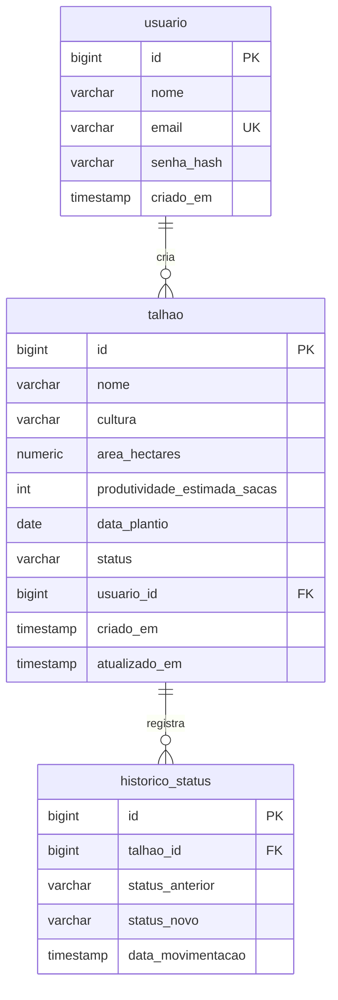

# AgroSafra

Sistema web full-stack para gestão do ciclo de safra: plantio, crescimento, colheita e comercialização de talhões agrícolas.

Trabalho final da disciplina **Desenvolvimento de Software WEB** — Prof. Alexandre Cláudio de Almeida (PUC Goiás / ADS).

## Arquitetura

```
┌────────────────┐     HTTP/JSON      ┌─────────────────┐     JPA      ┌──────────────┐
│   frontend/    │  Authorization:    │    backend/     │              │  PostgreSQL  │
│ React 18 + TS  │ ──Bearer <JWT>───▶ │ Spring Boot 3.5 │ ───────────▶ │  (Supabase)  │
│  Vite + Boot.  │ ◀──────────────────│  Spring Security│              │  H2 em dev   │
└────────────────┘                    └─────────────────┘              └──────────────┘
```

- **Front-end** (`frontend/`): React 18 + TypeScript (strict) + Vite + Bootstrap 5 + Recharts. Consome a API via `fetch` com token JWT; em dev, o proxy do Vite repassa `/api` para a porta 8080.
- **Back-end** (`backend/`): Spring Boot 3.5 (Java 21, Maven) em camadas `controller → service → repository`, DTOs com Bean Validation, tratamento de erros centralizado (`@RestControllerAdvice`).
- **Segurança**: Spring Security stateless — login devolve um JWT (HS256, expiração 24 h), filtro `JwtAuthFilter` valida o token a cada requisição, senhas com BCrypt.
- **Banco de dados**: PostgreSQL (Supabase) em produção; H2 em modo PostgreSQL no perfil `dev` (zero instalação). Schema com 3 tabelas e 2 relacionamentos — ver [diagrama ER](docs/diagrama-er.md).

## Funcionalidades

- Login e registro de usuários (JWT + BCrypt)
- CRUD completo de talhões (criar, listar, editar, excluir) com validação no front e no back
- Avanço do ciclo de safra (Plantio → Crescimento → Colheita → Comercializado → Plantio) com **histórico de movimentações** persistido
- Linha do tempo de cada talhão (modal de histórico)
- Busca por nome + filtros por status e cultura
- Dashboard com contadores e **gráficos** (talhões por status, área por cultura) que atualizam em tempo real
- Tratamento de erros padronizado na API (400/401/404/409/500 em JSON)

## Como rodar

Pré-requisitos: **Java 21**, **Node 18+**. (Maven não é necessário — o projeto usa Maven Wrapper.)

### 1. Back-end

```bash
cd backend
./mvnw spring-boot:run        # Windows: .\mvnw.cmd spring-boot:run
```

Sobe em `http://localhost:8080` com perfil `dev` (H2 em memória + seed automático).

- Usuário demo: `demo@agrosafra.com` / `agrosafra123`
- Console do banco: `http://localhost:8080/h2-console` (JDBC URL `jdbc:h2:mem:agrosafra`, usuário `sa`, senha vazia)

### 2. Front-end

```bash
cd frontend
npm install
npm run dev
```

Acesse `http://localhost:5173` e faça login com o usuário demo.

### Produção (Supabase)

Copie `backend/.env.example`, preencha a connection string do Supabase e o `JWT_SECRET`, e rode com `SPRING_PROFILES_ACTIVE=prod`. Nenhuma credencial fica no repositório.

## Endpoints da API

| Método | Rota | Auth | Descrição |
|--------|------|------|-----------|
| POST | `/api/auth/registro` | pública | cria usuário (senha com BCrypt) |
| POST | `/api/auth/login` | pública | autentica e retorna JWT |
| GET | `/api/talhoes` | JWT | lista, filtros opcionais `?status=&cultura=&busca=` |
| GET | `/api/talhoes/{id}` | JWT | detalhe |
| GET | `/api/talhoes/{id}/historico` | JWT | linha do tempo de movimentações |
| POST | `/api/talhoes` | JWT | cria (sempre em PLANTIO) |
| PUT | `/api/talhoes/{id}` | JWT | edita dados cadastrais |
| PATCH | `/api/talhoes/{id}/avancar-status` | JWT | avança o ciclo + grava histórico |
| DELETE | `/api/talhoes/{id}` | JWT | exclui (com o histórico) |

## Diagrama ER



Detalhes e DDL em [`docs/diagrama-er.md`](docs/diagrama-er.md).

## Justificativa das escolhas técnicas

- **Camadas no back-end** — `controller` cuida só de HTTP, `service` concentra as regras de negócio (ex.: a ordem do ciclo de safra vive em `StatusSafra.proximo()` e é aplicada no `TalhaoService`), `repository` isola o acesso a dados. Cada classe tem uma responsabilidade e é testável isoladamente.
- **DTOs em vez de expor entidades** — a API trafega `TalhaoRequest`/`TalhaoResponse`, nunca a entidade JPA. Isso protege campos internos (ex.: `senha_hash`) e permite validar a entrada com Bean Validation.
- **JWT stateless** — sem sessão no servidor: o token assinado carrega a identidade e cada requisição é autenticada pelo filtro. Escala horizontalmente e casa com front SPA.
- **Histórico em transação única** — avanço de status e gravação do histórico acontecem no mesmo `@Transactional`: ou ambos persistem, ou nenhum.
- **H2 em dev / PostgreSQL em prod** — o perfil `dev` roda sem instalar banco (H2 emulando PostgreSQL); o perfil `prod` aponta para o Supabase via variáveis de ambiente.
- **Estado único no front** — `App.tsx` mantém a lista de talhões carregada da API; Dashboard, gráficos e lista derivam tudo dela, então qualquer mudança reflete em todos os lugares sem estado duplicado.

## Estrutura do repositório

```
├── frontend/                 → React 18 + TypeScript + Vite
│   └── src/
│       ├── components/       → Login, Header, Sidebar, Footer, Dashboard, Talhao (cards, modais, filtros)
│       ├── services/api.ts   → camada única de comunicação com a API (injeta JWT, trata 401)
│       ├── styles/global.css → paleta agro e estilos custom
│       └── types/ITalhao.ts  → contratos do domínio (alinhados aos enums do back)
├── backend/                  → Spring Boot 3.5 (Java 21)
│   └── src/main/java/br/pucgo/agrosafra/
│       ├── config/           → SecurityConfig, CorsConfig, DataSeeder
│       ├── security/         → JwtService, JwtAuthFilter, UserDetailsServiceImpl
│       ├── controller/       → AuthController, TalhaoController
│       ├── service/          → AuthService, TalhaoService
│       ├── repository/       → Spring Data JPA
│       ├── model/            → entidades + enums
│       ├── dto/              → requests/responses validados
│       └── exception/        → handler global de erros
└── docs/
    └── diagrama-er.md        → diagrama ER + DDL
```

## Autor

Pedro Talalay — PUC Goiás
