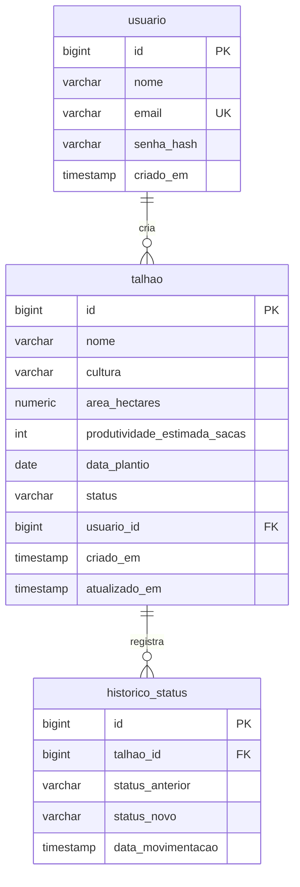

# AgroSafra — Diagrama ER

## Diagrama



## DDL equivalente (PostgreSQL)

O schema é gerado pelo Hibernate (`ddl-auto=update`); este DDL documenta o resultado.

```sql
CREATE TABLE usuario (
    id          BIGSERIAL PRIMARY KEY,
    nome        VARCHAR(255) NOT NULL,
    email       VARCHAR(255) NOT NULL UNIQUE,
    senha_hash  VARCHAR(255) NOT NULL,           -- hash BCrypt, nunca a senha em texto
    criado_em   TIMESTAMP NOT NULL
);

CREATE TABLE talhao (
    id                            BIGSERIAL PRIMARY KEY,
    nome                          VARCHAR(255) NOT NULL,
    cultura                       VARCHAR(255) NOT NULL,  -- enum: SOJA, MILHO, CAFE, CANA_DE_ACUCAR, ALGODAO
    area_hectares                 NUMERIC(10,2) NOT NULL,
    produtividade_estimada_sacas  INT NOT NULL,
    data_plantio                  DATE NOT NULL,
    status                        VARCHAR(255) NOT NULL,  -- enum: PLANTIO, CRESCIMENTO, COLHEITA, COMERCIALIZADO
    usuario_id                    BIGINT REFERENCES usuario(id),
    criado_em                     TIMESTAMP NOT NULL,
    atualizado_em                 TIMESTAMP
);

CREATE TABLE historico_status (
    id                 BIGSERIAL PRIMARY KEY,
    talhao_id          BIGINT NOT NULL REFERENCES talhao(id),
    status_anterior    VARCHAR(255) NOT NULL,
    status_novo        VARCHAR(255) NOT NULL,
    data_movimentacao  TIMESTAMP NOT NULL
);
```

## Decisões de modelagem

- **`usuario` 1:N `talhao`** — registro de autoria (quem cadastrou). Não há filtro por dono: todos os usuários autenticados enxergam todos os talhões da fazenda.
- **`talhao` 1:N `historico_status`** — cada avanço do ciclo grava uma movimentação, na mesma transação do update, formando a linha do tempo do talhão.
- **Enums como `VARCHAR`** — legível direto no banco e estável a reordenações do enum Java (evita os problemas clássicos do enum ordinal).
- **Exclusão de talhão** — o histórico é removido na mesma transação (`TalhaoService.excluir`) para não violar a FK.
