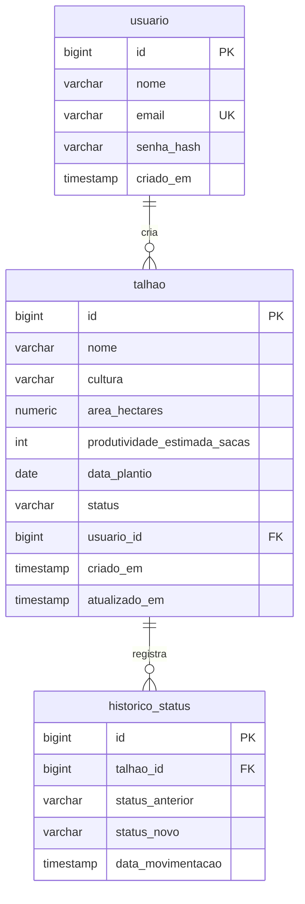

# AgroSafra v2 — Plano de Implementação

> **For agentic workers:** REQUIRED SUB-SKILL: Use superpowers:subagent-driven-development (recommended) or superpowers:executing-plans to implement this plan task-by-task. Steps use checkbox (`- [ ]`) syntax for tracking.

**Goal:** Construir o back-end Spring Boot (JWT + JPA + H2/Supabase) e integrar o front React existente com CRUD completo, histórico de movimentações, gráficos e documentação.

**Architecture:** Monorepo `frontend/` + `backend/`. Back-end em camadas (controller → service → repository) com Spring Security stateless JWT. Front consome a API via fetch com proxy do Vite em dev. Spec: `docs/superpowers/specs/2026-06-11-agrosafra-v2-design.md`.

**Tech Stack:** Spring Boot 3.3 (Java 21, Maven), Spring Security + jjwt 0.12, Spring Data JPA, H2 (dev) / PostgreSQL-Supabase (prod), React 18 + Vite + TS, Bootstrap 5, Recharts.

> **Nota sobre testes:** a spec exclui testes automatizados do escopo (decisão do usuário, prazo de entrega hoje). Cada task termina com **verificação manual** (compilação, curl ou navegador) antes do commit. Não pular as verificações.

---

## Task 1: Reestruturar o repo em monorepo

**Files:**
- Move: `index.html`, `package.json`, `package-lock.json`, `tsconfig.json`, `tsconfig.node.json`, `vite.config.ts`, `src/` → `frontend/`
- Delete: `tsconfig.tsbuildinfo`, `tsconfig.node.tsbuildinfo`, `vite.config.d.ts`, `vite.config.js` (artefatos de build)
- Modify: `.gitignore`

- [ ] **Step 1: Mover o front para `frontend/`**

```powershell
New-Item -ItemType Directory frontend
git mv index.html package.json package-lock.json tsconfig.json tsconfig.node.json vite.config.ts src frontend/
git rm --cached tsconfig.tsbuildinfo tsconfig.node.tsbuildinfo vite.config.d.ts vite.config.js
Remove-Item tsconfig.tsbuildinfo, tsconfig.node.tsbuildinfo, vite.config.d.ts, vite.config.js -Force
```

(Se algum dos artefatos não estiver rastreado no git, o `git rm --cached` falha para ele — remova só com `Remove-Item`.)

- [ ] **Step 2: Atualizar `.gitignore` na raiz**

```gitignore
# Front-end
frontend/node_modules/
frontend/dist/
*.tsbuildinfo
frontend/vite.config.d.ts
frontend/vite.config.js

# Back-end
backend/target/

# Ambiente
.env
*.local
```

- [ ] **Step 3: Reinstalar dependências e verificar que o front sobe**

```powershell
cd frontend; npm install; npm run dev
```

Esperado: Vite sobe em `http://localhost:5173` e a tela atual renderiza. Encerrar com Ctrl+C. (O `node_modules/` da raiz antiga pode ser apagado.)

- [ ] **Step 4: Commit**

```powershell
git add -A; git commit -m "refactor: move front-end para frontend/ (monorepo)"
```

---

## Task 2: Scaffold do back-end Spring Boot

**Files:**
- Create: `backend/` (via start.spring.io), `backend/src/main/resources/application.properties`, `application-dev.properties`, `application-prod.properties`, `backend/.env.example`

- [ ] **Step 1: Verificar pré-requisito Java 17+**

```powershell
java -version
```

Esperado: versão 17 ou superior. Se for 17, usar `-d javaVersion=17` no passo seguinte e ajustar `<java.version>` no pom.

- [ ] **Step 2: Gerar projeto no start.spring.io**

Na raiz do repo:

```powershell
curl.exe -s "https://start.spring.io/starter.zip" -d type=maven-project -d language=java -d bootVersion=3.3.5 -d javaVersion=21 -d groupId=br.pucgo -d artifactId=agrosafra -d name=agrosafra -d packageName=br.pucgo.agrosafra -d dependencies=web,data-jpa,security,validation,h2,postgresql -o backend.zip
Expand-Archive backend.zip -DestinationPath backend
Remove-Item backend.zip
```

- [ ] **Step 3: Adicionar jjwt ao `backend/pom.xml`** (dentro de `<dependencies>`)

```xml
<!-- Geração e validação de tokens JWT (segurança stateless) -->
<dependency>
    <groupId>io.jsonwebtoken</groupId>
    <artifactId>jjwt-api</artifactId>
    <version>0.12.6</version>
</dependency>
<dependency>
    <groupId>io.jsonwebtoken</groupId>
    <artifactId>jjwt-impl</artifactId>
    <version>0.12.6</version>
    <scope>runtime</scope>
</dependency>
<dependency>
    <groupId>io.jsonwebtoken</groupId>
    <artifactId>jjwt-jackson</artifactId>
    <version>0.12.6</version>
    <scope>runtime</scope>
</dependency>
```

- [ ] **Step 4: Configurar `backend/src/main/resources/application.properties`** (substituir conteúdo)

```properties
spring.application.name=agrosafra

# Perfil padrao: dev (H2). Em producao, usar SPRING_PROFILES_ACTIVE=prod (Supabase).
spring.profiles.active=${SPRING_PROFILES_ACTIVE:dev}

# Segredo usado para assinar o JWT (HS256). Em producao, definir JWT_SECRET no ambiente.
app.jwt.secret=${JWT_SECRET:segredo-apenas-para-desenvolvimento-local-trocar-em-producao-1234567890}
app.jwt.expiracao-horas=24
```

- [ ] **Step 5: Criar `backend/src/main/resources/application-dev.properties`**

```properties
# H2 em memoria emulando PostgreSQL — permite desenvolver sem o Supabase configurado.
spring.datasource.url=jdbc:h2:mem:agrosafra;MODE=PostgreSQL;DATABASE_TO_LOWER=TRUE;DEFAULT_NULL_ORDERING=HIGH
spring.datasource.driver-class-name=org.h2.Driver
spring.datasource.username=sa
spring.datasource.password=

spring.jpa.hibernate.ddl-auto=update
spring.jpa.show-sql=true

# Console web do H2 em /h2-console (util para demonstrar o banco na apresentacao)
spring.h2.console.enabled=true
```

- [ ] **Step 6: Criar `backend/src/main/resources/application-prod.properties`**

```properties
# Producao: PostgreSQL no Supabase. Todas as credenciais vem do ambiente — nada commitado.
spring.datasource.url=${SPRING_DATASOURCE_URL}
spring.datasource.username=${SPRING_DATASOURCE_USERNAME}
spring.datasource.password=${SPRING_DATASOURCE_PASSWORD}

spring.jpa.hibernate.ddl-auto=update
spring.jpa.show-sql=false
```

- [ ] **Step 7: Criar `backend/.env.example`**

```properties
# Copie para .env (ou exporte no ambiente) antes de rodar com perfil prod
SPRING_PROFILES_ACTIVE=prod
SPRING_DATASOURCE_URL=jdbc:postgresql://db.SEU-PROJETO.supabase.co:5432/postgres
SPRING_DATASOURCE_USERNAME=postgres
SPRING_DATASOURCE_PASSWORD=sua-senha
JWT_SECRET=um-segredo-longo-e-aleatorio-com-no-minimo-32-caracteres
```

- [ ] **Step 8: Verificar que compila**

```powershell
cd backend; .\mvnw.cmd -q compile
```

Esperado: BUILD SUCCESS.

- [ ] **Step 9: Commit**

```powershell
git add -A; git commit -m "feat(back): scaffold Spring Boot com perfis dev (H2) e prod (Supabase)"
```

---

## Task 3: Modelos, enums e repositories

**Files:**
- Create: `backend/src/main/java/br/pucgo/agrosafra/model/StatusSafra.java`, `TipoCultura.java`, `Usuario.java`, `Talhao.java`, `HistoricoStatus.java`
- Create: `backend/src/main/java/br/pucgo/agrosafra/repository/UsuarioRepository.java`, `TalhaoRepository.java`, `HistoricoStatusRepository.java`

- [ ] **Step 1: Criar `model/StatusSafra.java`**

```java
package br.pucgo.agrosafra.model;

/**
 * Etapas do ciclo de safra de um talhão.
 * O ciclo é fixo e circular: ao comercializar, o talhão volta ao plantio.
 */
public enum StatusSafra {
    PLANTIO, CRESCIMENTO, COLHEITA, COMERCIALIZADO;

    /** Retorna a próxima etapa do ciclo (COMERCIALIZADO reinicia em PLANTIO). */
    public StatusSafra proximo() {
        return switch (this) {
            case PLANTIO -> CRESCIMENTO;
            case CRESCIMENTO -> COLHEITA;
            case COLHEITA -> COMERCIALIZADO;
            case COMERCIALIZADO -> PLANTIO;
        };
    }
}
```

- [ ] **Step 2: Criar `model/TipoCultura.java`**

```java
package br.pucgo.agrosafra.model;

/** Culturas agrícolas suportadas pelo sistema. */
public enum TipoCultura {
    SOJA, MILHO, CAFE, CANA_DE_ACUCAR, ALGODAO
}
```

- [ ] **Step 3: Criar `model/Usuario.java`**

```java
package br.pucgo.agrosafra.model;

import jakarta.persistence.*;
import java.time.Instant;

/** Usuário do sistema. A senha é sempre armazenada com hash BCrypt. */
@Entity
@Table(name = "usuario")
public class Usuario {

    @Id
    @GeneratedValue(strategy = GenerationType.IDENTITY)
    private Long id;

    @Column(nullable = false)
    private String nome;

    @Column(nullable = false, unique = true)
    private String email;

    @Column(name = "senha_hash", nullable = false)
    private String senhaHash;

    @Column(name = "criado_em", nullable = false, updatable = false)
    private Instant criadoEm;

    @PrePersist
    void aoCriar() {
        this.criadoEm = Instant.now();
    }

    public Long getId() { return id; }
    public String getNome() { return nome; }
    public void setNome(String nome) { this.nome = nome; }
    public String getEmail() { return email; }
    public void setEmail(String email) { this.email = email; }
    public String getSenhaHash() { return senhaHash; }
    public void setSenhaHash(String senhaHash) { this.senhaHash = senhaHash; }
    public Instant getCriadoEm() { return criadoEm; }
}
```

- [ ] **Step 4: Criar `model/Talhao.java`**

```java
package br.pucgo.agrosafra.model;

import jakarta.persistence.*;
import java.math.BigDecimal;
import java.time.Instant;
import java.time.LocalDate;

/**
 * Talhão agrícola: unidade de área da fazenda com uma cultura e um
 * status dentro do ciclo de safra. Guarda referência ao usuário que o criou.
 */
@Entity
@Table(name = "talhao")
public class Talhao {

    @Id
    @GeneratedValue(strategy = GenerationType.IDENTITY)
    private Long id;

    @Column(nullable = false)
    private String nome;

    @Enumerated(EnumType.STRING)
    @Column(nullable = false)
    private TipoCultura cultura;

    @Column(name = "area_hectares", nullable = false, precision = 10, scale = 2)
    private BigDecimal areaHectares;

    @Column(name = "produtividade_estimada_sacas", nullable = false)
    private Integer produtividadeEstimadaSacas;

    @Column(name = "data_plantio", nullable = false)
    private LocalDate dataPlantio;

    @Enumerated(EnumType.STRING)
    @Column(nullable = false)
    private StatusSafra status;

    /** Usuário que cadastrou o talhão (apenas registro de autoria, sem filtro por dono). */
    @ManyToOne(fetch = FetchType.LAZY)
    @JoinColumn(name = "usuario_id")
    private Usuario usuario;

    @Column(name = "criado_em", nullable = false, updatable = false)
    private Instant criadoEm;

    @Column(name = "atualizado_em")
    private Instant atualizadoEm;

    @PrePersist
    void aoCriar() {
        this.criadoEm = Instant.now();
        this.atualizadoEm = this.criadoEm;
    }

    @PreUpdate
    void aoAtualizar() {
        this.atualizadoEm = Instant.now();
    }

    public Long getId() { return id; }
    public String getNome() { return nome; }
    public void setNome(String nome) { this.nome = nome; }
    public TipoCultura getCultura() { return cultura; }
    public void setCultura(TipoCultura cultura) { this.cultura = cultura; }
    public BigDecimal getAreaHectares() { return areaHectares; }
    public void setAreaHectares(BigDecimal areaHectares) { this.areaHectares = areaHectares; }
    public Integer getProdutividadeEstimadaSacas() { return produtividadeEstimadaSacas; }
    public void setProdutividadeEstimadaSacas(Integer valor) { this.produtividadeEstimadaSacas = valor; }
    public LocalDate getDataPlantio() { return dataPlantio; }
    public void setDataPlantio(LocalDate dataPlantio) { this.dataPlantio = dataPlantio; }
    public StatusSafra getStatus() { return status; }
    public void setStatus(StatusSafra status) { this.status = status; }
    public Usuario getUsuario() { return usuario; }
    public void setUsuario(Usuario usuario) { this.usuario = usuario; }
    public Instant getCriadoEm() { return criadoEm; }
    public Instant getAtualizadoEm() { return atualizadoEm; }
}
```

- [ ] **Step 5: Criar `model/HistoricoStatus.java`**

```java
package br.pucgo.agrosafra.model;

import jakarta.persistence.*;
import java.time.Instant;

/**
 * Registro de movimentação de status de um talhão.
 * Uma linha é gravada a cada avanço do ciclo de safra, formando a linha do tempo.
 */
@Entity
@Table(name = "historico_status")
public class HistoricoStatus {

    @Id
    @GeneratedValue(strategy = GenerationType.IDENTITY)
    private Long id;

    @ManyToOne(fetch = FetchType.LAZY, optional = false)
    @JoinColumn(name = "talhao_id", nullable = false)
    private Talhao talhao;

    @Enumerated(EnumType.STRING)
    @Column(name = "status_anterior", nullable = false)
    private StatusSafra statusAnterior;

    @Enumerated(EnumType.STRING)
    @Column(name = "status_novo", nullable = false)
    private StatusSafra statusNovo;

    @Column(name = "data_movimentacao", nullable = false, updatable = false)
    private Instant dataMovimentacao;

    @PrePersist
    void aoCriar() {
        this.dataMovimentacao = Instant.now();
    }

    public Long getId() { return id; }
    public Talhao getTalhao() { return talhao; }
    public void setTalhao(Talhao talhao) { this.talhao = talhao; }
    public StatusSafra getStatusAnterior() { return statusAnterior; }
    public void setStatusAnterior(StatusSafra statusAnterior) { this.statusAnterior = statusAnterior; }
    public StatusSafra getStatusNovo() { return statusNovo; }
    public void setStatusNovo(StatusSafra statusNovo) { this.statusNovo = statusNovo; }
    public Instant getDataMovimentacao() { return dataMovimentacao; }
}
```

- [ ] **Step 6: Criar os 3 repositories**

`repository/UsuarioRepository.java`:

```java
package br.pucgo.agrosafra.repository;

import br.pucgo.agrosafra.model.Usuario;
import org.springframework.data.jpa.repository.JpaRepository;
import java.util.Optional;

/** Acesso a dados de usuários. */
public interface UsuarioRepository extends JpaRepository<Usuario, Long> {
    Optional<Usuario> findByEmail(String email);
    boolean existsByEmail(String email);
}
```

`repository/TalhaoRepository.java`:

```java
package br.pucgo.agrosafra.repository;

import br.pucgo.agrosafra.model.Talhao;
import org.springframework.data.jpa.repository.JpaRepository;
import java.util.List;

/** Acesso a dados de talhões. */
public interface TalhaoRepository extends JpaRepository<Talhao, Long> {
    List<Talhao> findAllByOrderByNomeAsc();
}
```

`repository/HistoricoStatusRepository.java`:

```java
package br.pucgo.agrosafra.repository;

import br.pucgo.agrosafra.model.HistoricoStatus;
import org.springframework.data.jpa.repository.JpaRepository;
import java.util.List;

/** Acesso a dados do histórico de movimentações de status. */
public interface HistoricoStatusRepository extends JpaRepository<HistoricoStatus, Long> {
    List<HistoricoStatus> findByTalhaoIdOrderByDataMovimentacaoDesc(Long talhaoId);
    void deleteByTalhaoId(Long talhaoId);
}
```

- [ ] **Step 7: Verificar compilação**

```powershell
cd backend; .\mvnw.cmd -q compile
```

Esperado: BUILD SUCCESS.

- [ ] **Step 8: Commit**

```powershell
git add -A; git commit -m "feat(back): entidades Usuario, Talhao e HistoricoStatus com repositories"
```

---

## Task 4: Tratamento de erros centralizado

**Files:**
- Create: `backend/src/main/java/br/pucgo/agrosafra/exception/RecursoNaoEncontradoException.java`, `ErroResponse.java`, `GlobalExceptionHandler.java`

- [ ] **Step 1: Criar `exception/RecursoNaoEncontradoException.java`**

```java
package br.pucgo.agrosafra.exception;

/** Lançada quando um recurso (talhão, usuário) não existe no banco. Vira HTTP 404. */
public class RecursoNaoEncontradoException extends RuntimeException {
    public RecursoNaoEncontradoException(String mensagem) {
        super(mensagem);
    }
}
```

- [ ] **Step 2: Criar `exception/ErroResponse.java`**

```java
package br.pucgo.agrosafra.exception;

import java.util.Map;

/** Formato padronizado de erro retornado pela API. */
public record ErroResponse(int status, String mensagem, Map<String, String> detalhes) {
    public ErroResponse(int status, String mensagem) {
        this(status, mensagem, null);
    }
}
```

- [ ] **Step 3: Criar `exception/GlobalExceptionHandler.java`**

```java
package br.pucgo.agrosafra.exception;

import org.springframework.dao.DataIntegrityViolationException;
import org.springframework.http.HttpStatus;
import org.springframework.security.authentication.BadCredentialsException;
import org.springframework.validation.FieldError;
import org.springframework.web.bind.MethodArgumentNotValidException;
import org.springframework.web.bind.annotation.ExceptionHandler;
import org.springframework.web.bind.annotation.ResponseStatus;
import org.springframework.web.bind.annotation.RestControllerAdvice;

import java.util.HashMap;
import java.util.Map;

/**
 * Converte exceções em respostas JSON padronizadas (ErroResponse),
 * mantendo os controllers livres de try/catch repetitivo.
 */
@RestControllerAdvice
public class GlobalExceptionHandler {

    @ExceptionHandler(RecursoNaoEncontradoException.class)
    @ResponseStatus(HttpStatus.NOT_FOUND)
    public ErroResponse tratarNaoEncontrado(RecursoNaoEncontradoException e) {
        return new ErroResponse(404, e.getMessage());
    }

    /** Erros de Bean Validation nos DTOs: devolve um mapa campo → mensagem. */
    @ExceptionHandler(MethodArgumentNotValidException.class)
    @ResponseStatus(HttpStatus.BAD_REQUEST)
    public ErroResponse tratarValidacao(MethodArgumentNotValidException e) {
        Map<String, String> detalhes = new HashMap<>();
        for (FieldError erro : e.getBindingResult().getFieldErrors()) {
            detalhes.put(erro.getField(), erro.getDefaultMessage());
        }
        return new ErroResponse(400, "Dados inválidos", detalhes);
    }

    @ExceptionHandler(BadCredentialsException.class)
    @ResponseStatus(HttpStatus.UNAUTHORIZED)
    public ErroResponse tratarCredenciaisInvalidas(BadCredentialsException e) {
        return new ErroResponse(401, "E-mail ou senha inválidos");
    }

    @ExceptionHandler(DataIntegrityViolationException.class)
    @ResponseStatus(HttpStatus.CONFLICT)
    public ErroResponse tratarIntegridade(DataIntegrityViolationException e) {
        return new ErroResponse(409, "Violação de integridade de dados (registro duplicado ou em uso)");
    }

    @ExceptionHandler(Exception.class)
    @ResponseStatus(HttpStatus.INTERNAL_SERVER_ERROR)
    public ErroResponse tratarGenerico(Exception e) {
        return new ErroResponse(500, "Erro interno no servidor");
    }
}
```

- [ ] **Step 4: Verificar compilação e commit**

```powershell
cd backend; .\mvnw.cmd -q compile
git add -A; git commit -m "feat(back): tratamento de erros centralizado com @RestControllerAdvice"
```

---

## Task 5: Segurança — JWT + Spring Security

**Files:**
- Create: `backend/src/main/java/br/pucgo/agrosafra/security/JwtService.java`, `UserDetailsServiceImpl.java`, `JwtAuthFilter.java`
- Create: `backend/src/main/java/br/pucgo/agrosafra/config/SecurityConfig.java`, `CorsConfig.java`

- [ ] **Step 1: Criar `security/JwtService.java`**

```java
package br.pucgo.agrosafra.security;

import io.jsonwebtoken.Jwts;
import io.jsonwebtoken.security.Keys;
import org.springframework.beans.factory.annotation.Value;
import org.springframework.stereotype.Service;

import javax.crypto.SecretKey;
import java.nio.charset.StandardCharsets;
import java.util.Date;

/**
 * Geração e leitura de tokens JWT assinados com HS256.
 * O segredo e a expiração vêm de application.properties (app.jwt.*).
 */
@Service
public class JwtService {

    @Value("${app.jwt.secret}")
    private String segredo;

    @Value("${app.jwt.expiracao-horas}")
    private long expiracaoHoras;

    private SecretKey chave() {
        return Keys.hmacShaKeyFor(segredo.getBytes(StandardCharsets.UTF_8));
    }

    /** Gera um token tendo o e-mail do usuário como subject. */
    public String gerarToken(String email) {
        Date agora = new Date();
        Date expiracao = new Date(agora.getTime() + expiracaoHoras * 3_600_000L);
        return Jwts.builder()
                .subject(email)
                .issuedAt(agora)
                .expiration(expiracao)
                .signWith(chave())
                .compact();
    }

    /**
     * Extrai o e-mail (subject) de um token válido.
     * Lança JwtException se o token for inválido ou expirado.
     */
    public String extrairEmail(String token) {
        return Jwts.parser()
                .verifyWith(chave())
                .build()
                .parseSignedClaims(token)
                .getPayload()
                .getSubject();
    }
}
```

- [ ] **Step 2: Criar `security/UserDetailsServiceImpl.java`**

```java
package br.pucgo.agrosafra.security;

import br.pucgo.agrosafra.repository.UsuarioRepository;
import org.springframework.security.core.userdetails.User;
import org.springframework.security.core.userdetails.UserDetails;
import org.springframework.security.core.userdetails.UserDetailsService;
import org.springframework.security.core.userdetails.UsernameNotFoundException;
import org.springframework.stereotype.Service;

/** Adapta a entidade Usuario para o contrato UserDetails do Spring Security. */
@Service
public class UserDetailsServiceImpl implements UserDetailsService {

    private final UsuarioRepository usuarioRepository;

    public UserDetailsServiceImpl(UsuarioRepository usuarioRepository) {
        this.usuarioRepository = usuarioRepository;
    }

    @Override
    public UserDetails loadUserByUsername(String email) throws UsernameNotFoundException {
        return usuarioRepository.findByEmail(email)
                .map(u -> User.withUsername(u.getEmail())
                        .password(u.getSenhaHash())
                        .authorities("USER")
                        .build())
                .orElseThrow(() -> new UsernameNotFoundException("Usuário não encontrado: " + email));
    }
}
```

- [ ] **Step 3: Criar `security/JwtAuthFilter.java`**

```java
package br.pucgo.agrosafra.security;

import io.jsonwebtoken.JwtException;
import jakarta.servlet.FilterChain;
import jakarta.servlet.ServletException;
import jakarta.servlet.http.HttpServletRequest;
import jakarta.servlet.http.HttpServletResponse;
import org.springframework.security.authentication.UsernamePasswordAuthenticationToken;
import org.springframework.security.core.context.SecurityContextHolder;
import org.springframework.security.core.userdetails.UserDetails;
import org.springframework.security.web.authentication.WebAuthenticationDetailsSource;
import org.springframework.stereotype.Component;
import org.springframework.web.filter.OncePerRequestFilter;

import java.io.IOException;

/**
 * Filtro executado uma vez por requisição: lê o header Authorization,
 * valida o JWT e popula o SecurityContext. Tokens ausentes ou inválidos
 * apenas seguem sem autenticação — a rota protegida responderá 401.
 */
@Component
public class JwtAuthFilter extends OncePerRequestFilter {

    private final JwtService jwtService;
    private final UserDetailsServiceImpl userDetailsService;

    public JwtAuthFilter(JwtService jwtService, UserDetailsServiceImpl userDetailsService) {
        this.jwtService = jwtService;
        this.userDetailsService = userDetailsService;
    }

    @Override
    protected void doFilterInternal(HttpServletRequest request, HttpServletResponse response,
                                    FilterChain filterChain) throws ServletException, IOException {
        String header = request.getHeader("Authorization");

        if (header != null && header.startsWith("Bearer ")
                && SecurityContextHolder.getContext().getAuthentication() == null) {
            try {
                String email = jwtService.extrairEmail(header.substring(7));
                UserDetails detalhes = userDetailsService.loadUserByUsername(email);
                var autenticacao = new UsernamePasswordAuthenticationToken(
                        detalhes, null, detalhes.getAuthorities());
                autenticacao.setDetails(new WebAuthenticationDetailsSource().buildDetails(request));
                SecurityContextHolder.getContext().setAuthentication(autenticacao);
            } catch (JwtException e) {
                // Token inválido/expirado: segue sem autenticar (rotas protegidas devolvem 401).
            }
        }
        filterChain.doFilter(request, response);
    }
}
```

- [ ] **Step 4: Criar `config/CorsConfig.java`**

```java
package br.pucgo.agrosafra.config;

import org.springframework.context.annotation.Bean;
import org.springframework.context.annotation.Configuration;
import org.springframework.web.cors.CorsConfiguration;
import org.springframework.web.cors.CorsConfigurationSource;
import org.springframework.web.cors.UrlBasedCorsConfigurationSource;

import java.util.List;

/**
 * Libera o front-end (Vite, porta 5173) para consumir a API.
 * Em dev o proxy do Vite já evita CORS, mas esta configuração garante
 * o funcionamento também com o front acessando a API diretamente.
 */
@Configuration
public class CorsConfig {

    @Bean
    public CorsConfigurationSource corsConfigurationSource() {
        CorsConfiguration config = new CorsConfiguration();
        config.setAllowedOrigins(List.of("http://localhost:5173"));
        config.setAllowedMethods(List.of("GET", "POST", "PUT", "PATCH", "DELETE", "OPTIONS"));
        config.setAllowedHeaders(List.of("*"));

        UrlBasedCorsConfigurationSource source = new UrlBasedCorsConfigurationSource();
        source.registerCorsConfiguration("/api/**", config);
        return source;
    }
}
```

- [ ] **Step 5: Criar `config/SecurityConfig.java`**

```java
package br.pucgo.agrosafra.config;

import br.pucgo.agrosafra.security.JwtAuthFilter;
import org.springframework.context.annotation.Bean;
import org.springframework.context.annotation.Configuration;
import org.springframework.security.authentication.AuthenticationManager;
import org.springframework.security.config.Customizer;
import org.springframework.security.config.annotation.authentication.configuration.AuthenticationConfiguration;
import org.springframework.security.config.annotation.web.builders.HttpSecurity;
import org.springframework.security.config.annotation.web.configuration.EnableWebSecurity;
import org.springframework.security.config.http.SessionCreationPolicy;
import org.springframework.security.crypto.bcrypt.BCryptPasswordEncoder;
import org.springframework.security.crypto.password.PasswordEncoder;
import org.springframework.security.web.SecurityFilterChain;
import org.springframework.security.web.authentication.UsernamePasswordAuthenticationFilter;

/**
 * Configuração central do Spring Security:
 * API stateless protegida por JWT; apenas /api/auth/** é público.
 */
@Configuration
@EnableWebSecurity
public class SecurityConfig {

    private final JwtAuthFilter jwtAuthFilter;

    public SecurityConfig(JwtAuthFilter jwtAuthFilter) {
        this.jwtAuthFilter = jwtAuthFilter;
    }

    @Bean
    public SecurityFilterChain filterChain(HttpSecurity http) throws Exception {
        http
            .csrf(csrf -> csrf.disable()) // API stateless com JWT não usa cookies de sessão
            .cors(Customizer.withDefaults())
            .sessionManagement(s -> s.sessionCreationPolicy(SessionCreationPolicy.STATELESS))
            .authorizeHttpRequests(auth -> auth
                .requestMatchers("/api/auth/**", "/h2-console/**").permitAll()
                .anyRequest().authenticated())
            // Permite o console do H2 renderizar em iframe (apenas dev)
            .headers(h -> h.frameOptions(f -> f.sameOrigin()))
            // Sem autenticação: devolve 401 em JSON no mesmo formato do ErroResponse
            .exceptionHandling(ex -> ex.authenticationEntryPoint((req, res, e) -> {
                res.setStatus(401);
                res.setContentType("application/json;charset=UTF-8");
                res.getWriter().write("{\"status\":401,\"mensagem\":\"Não autenticado: faça login para acessar este recurso\"}");
            }))
            .addFilterBefore(jwtAuthFilter, UsernamePasswordAuthenticationFilter.class);

        return http.build();
    }

    @Bean
    public PasswordEncoder passwordEncoder() {
        return new BCryptPasswordEncoder();
    }

    @Bean
    public AuthenticationManager authenticationManager(AuthenticationConfiguration config) throws Exception {
        return config.getAuthenticationManager();
    }
}
```

- [ ] **Step 6: Verificar compilação e commit**

```powershell
cd backend; .\mvnw.cmd -q compile
git add -A; git commit -m "feat(back): Spring Security stateless com filtro JWT, BCrypt e CORS"
```

---

## Task 6: Autenticação — registro e login

**Files:**
- Create: `backend/src/main/java/br/pucgo/agrosafra/dto/RegistroRequest.java`, `LoginRequest.java`, `LoginResponse.java`
- Create: `backend/src/main/java/br/pucgo/agrosafra/service/AuthService.java`
- Create: `backend/src/main/java/br/pucgo/agrosafra/controller/AuthController.java`

- [ ] **Step 1: Criar os DTOs de autenticação**

`dto/RegistroRequest.java`:

```java
package br.pucgo.agrosafra.dto;

import jakarta.validation.constraints.Email;
import jakarta.validation.constraints.NotBlank;
import jakarta.validation.constraints.Size;

/** Dados para criação de uma nova conta. */
public record RegistroRequest(
        @NotBlank(message = "Nome é obrigatório") String nome,
        @NotBlank(message = "E-mail é obrigatório") @Email(message = "E-mail inválido") String email,
        @NotBlank(message = "Senha é obrigatória")
        @Size(min = 6, message = "Senha deve ter no mínimo 6 caracteres") String senha) {
}
```

`dto/LoginRequest.java`:

```java
package br.pucgo.agrosafra.dto;

import jakarta.validation.constraints.Email;
import jakarta.validation.constraints.NotBlank;

/** Credenciais de login. */
public record LoginRequest(
        @NotBlank(message = "E-mail é obrigatório") @Email(message = "E-mail inválido") String email,
        @NotBlank(message = "Senha é obrigatória") String senha) {
}
```

`dto/LoginResponse.java`:

```java
package br.pucgo.agrosafra.dto;

/** Resposta de autenticação: token JWT + dados básicos do usuário. */
public record LoginResponse(String token, String nome, String email) {
}
```

- [ ] **Step 2: Criar `service/AuthService.java`**

```java
package br.pucgo.agrosafra.service;

import br.pucgo.agrosafra.dto.LoginRequest;
import br.pucgo.agrosafra.dto.LoginResponse;
import br.pucgo.agrosafra.dto.RegistroRequest;
import br.pucgo.agrosafra.exception.RecursoNaoEncontradoException;
import br.pucgo.agrosafra.model.Usuario;
import br.pucgo.agrosafra.repository.UsuarioRepository;
import br.pucgo.agrosafra.security.JwtService;
import org.springframework.dao.DataIntegrityViolationException;
import org.springframework.security.authentication.AuthenticationManager;
import org.springframework.security.authentication.UsernamePasswordAuthenticationToken;
import org.springframework.security.crypto.password.PasswordEncoder;
import org.springframework.stereotype.Service;

/** Regras de registro e login de usuários. */
@Service
public class AuthService {

    private final UsuarioRepository usuarioRepository;
    private final PasswordEncoder passwordEncoder;
    private final JwtService jwtService;
    private final AuthenticationManager authenticationManager;

    public AuthService(UsuarioRepository usuarioRepository, PasswordEncoder passwordEncoder,
                       JwtService jwtService, AuthenticationManager authenticationManager) {
        this.usuarioRepository = usuarioRepository;
        this.passwordEncoder = passwordEncoder;
        this.jwtService = jwtService;
        this.authenticationManager = authenticationManager;
    }

    /** Cria a conta (senha com BCrypt) e já devolve o token — o usuário entra logado. */
    public LoginResponse registrar(RegistroRequest dados) {
        if (usuarioRepository.existsByEmail(dados.email())) {
            throw new DataIntegrityViolationException("E-mail já cadastrado");
        }
        Usuario usuario = new Usuario();
        usuario.setNome(dados.nome());
        usuario.setEmail(dados.email());
        usuario.setSenhaHash(passwordEncoder.encode(dados.senha()));
        usuarioRepository.save(usuario);

        return new LoginResponse(jwtService.gerarToken(usuario.getEmail()),
                usuario.getNome(), usuario.getEmail());
    }

    /** Valida as credenciais via AuthenticationManager e devolve o token. */
    public LoginResponse login(LoginRequest dados) {
        authenticationManager.authenticate(
                new UsernamePasswordAuthenticationToken(dados.email(), dados.senha()));

        Usuario usuario = usuarioRepository.findByEmail(dados.email())
                .orElseThrow(() -> new RecursoNaoEncontradoException("Usuário não encontrado"));

        return new LoginResponse(jwtService.gerarToken(usuario.getEmail()),
                usuario.getNome(), usuario.getEmail());
    }
}
```

- [ ] **Step 3: Criar `controller/AuthController.java`**

```java
package br.pucgo.agrosafra.controller;

import br.pucgo.agrosafra.dto.LoginRequest;
import br.pucgo.agrosafra.dto.LoginResponse;
import br.pucgo.agrosafra.dto.RegistroRequest;
import br.pucgo.agrosafra.service.AuthService;
import jakarta.validation.Valid;
import org.springframework.http.HttpStatus;
import org.springframework.http.ResponseEntity;
import org.springframework.web.bind.annotation.*;

/** Endpoints públicos de autenticação. */
@RestController
@RequestMapping("/api/auth")
public class AuthController {

    private final AuthService authService;

    public AuthController(AuthService authService) {
        this.authService = authService;
    }

    @PostMapping("/registro")
    public ResponseEntity<LoginResponse> registrar(@Valid @RequestBody RegistroRequest dados) {
        return ResponseEntity.status(HttpStatus.CREATED).body(authService.registrar(dados));
    }

    @PostMapping("/login")
    public LoginResponse login(@Valid @RequestBody LoginRequest dados) {
        return authService.login(dados);
    }
}
```

- [ ] **Step 4: Subir a aplicação e testar com curl**

```powershell
cd backend; .\mvnw.cmd spring-boot:run
```

Em outro terminal:

```powershell
curl.exe -s -X POST http://localhost:8080/api/auth/registro -H "Content-Type: application/json" -d "{\"nome\":\"Teste\",\"email\":\"teste@puc.com\",\"senha\":\"123456\"}"
```

Esperado: JSON com `token`, `nome`, `email` (HTTP 201).

```powershell
curl.exe -s -X POST http://localhost:8080/api/auth/login -H "Content-Type: application/json" -d "{\"email\":\"teste@puc.com\",\"senha\":\"errada\"}"
```

Esperado: `{"status":401,"mensagem":"E-mail ou senha inválidos"...}`.

- [ ] **Step 5: Commit**

```powershell
git add -A; git commit -m "feat(back): registro e login com JWT"
```

---

## Task 7: CRUD de talhões + histórico + seed

**Files:**
- Create: `backend/src/main/java/br/pucgo/agrosafra/dto/TalhaoRequest.java`, `TalhaoResponse.java`, `HistoricoResponse.java`
- Create: `backend/src/main/java/br/pucgo/agrosafra/service/TalhaoService.java`
- Create: `backend/src/main/java/br/pucgo/agrosafra/controller/TalhaoController.java`
- Create: `backend/src/main/java/br/pucgo/agrosafra/config/DataSeeder.java`

- [ ] **Step 1: Criar os DTOs de talhão**

`dto/TalhaoRequest.java`:

```java
package br.pucgo.agrosafra.dto;

import br.pucgo.agrosafra.model.TipoCultura;
import jakarta.validation.constraints.*;

import java.math.BigDecimal;
import java.time.LocalDate;

/** Dados de criação/edição de um talhão (o status é controlado pelo sistema). */
public record TalhaoRequest(
        @NotBlank(message = "Nome é obrigatório") String nome,
        @NotNull(message = "Cultura é obrigatória") TipoCultura cultura,
        @NotNull(message = "Área é obrigatória")
        @Positive(message = "Área deve ser maior que zero") BigDecimal areaHectares,
        @NotNull(message = "Produtividade é obrigatória")
        @PositiveOrZero(message = "Produtividade não pode ser negativa") Integer produtividadeEstimadaSacas,
        @NotNull(message = "Data de plantio é obrigatória") LocalDate dataPlantio) {
}
```

`dto/TalhaoResponse.java`:

```java
package br.pucgo.agrosafra.dto;

import br.pucgo.agrosafra.model.StatusSafra;
import br.pucgo.agrosafra.model.Talhao;
import br.pucgo.agrosafra.model.TipoCultura;

import java.math.BigDecimal;
import java.time.LocalDate;

/** Representação de um talhão na API (não expõe a entidade JPA). */
public record TalhaoResponse(
        Long id,
        String nome,
        TipoCultura cultura,
        BigDecimal areaHectares,
        Integer produtividadeEstimadaSacas,
        LocalDate dataPlantio,
        StatusSafra status) {

    public static TalhaoResponse de(Talhao t) {
        return new TalhaoResponse(t.getId(), t.getNome(), t.getCultura(), t.getAreaHectares(),
                t.getProdutividadeEstimadaSacas(), t.getDataPlantio(), t.getStatus());
    }
}
```

`dto/HistoricoResponse.java`:

```java
package br.pucgo.agrosafra.dto;

import br.pucgo.agrosafra.model.HistoricoStatus;
import br.pucgo.agrosafra.model.StatusSafra;

import java.time.Instant;

/** Uma movimentação de status na linha do tempo do talhão. */
public record HistoricoResponse(
        Long id,
        StatusSafra statusAnterior,
        StatusSafra statusNovo,
        Instant dataMovimentacao) {

    public static HistoricoResponse de(HistoricoStatus h) {
        return new HistoricoResponse(h.getId(), h.getStatusAnterior(), h.getStatusNovo(),
                h.getDataMovimentacao());
    }
}
```

- [ ] **Step 2: Criar `service/TalhaoService.java`**

```java
package br.pucgo.agrosafra.service;

import br.pucgo.agrosafra.dto.HistoricoResponse;
import br.pucgo.agrosafra.dto.TalhaoRequest;
import br.pucgo.agrosafra.dto.TalhaoResponse;
import br.pucgo.agrosafra.exception.RecursoNaoEncontradoException;
import br.pucgo.agrosafra.model.*;
import br.pucgo.agrosafra.repository.HistoricoStatusRepository;
import br.pucgo.agrosafra.repository.TalhaoRepository;
import br.pucgo.agrosafra.repository.UsuarioRepository;
import org.springframework.stereotype.Service;
import org.springframework.transaction.annotation.Transactional;

import java.util.List;

/**
 * Regras de negócio dos talhões: CRUD, avanço do ciclo de safra
 * (com gravação de histórico) e consulta da linha do tempo.
 */
@Service
public class TalhaoService {

    private final TalhaoRepository talhaoRepository;
    private final HistoricoStatusRepository historicoRepository;
    private final UsuarioRepository usuarioRepository;

    public TalhaoService(TalhaoRepository talhaoRepository,
                         HistoricoStatusRepository historicoRepository,
                         UsuarioRepository usuarioRepository) {
        this.talhaoRepository = talhaoRepository;
        this.historicoRepository = historicoRepository;
        this.usuarioRepository = usuarioRepository;
    }

    /**
     * Lista talhões com filtros opcionais.
     * Filtragem em memória: o volume de talhões de uma fazenda é pequeno e isso
     * evita query dinâmica; com crescimento real, migraria para Specifications.
     */
    public List<TalhaoResponse> listar(StatusSafra status, TipoCultura cultura, String busca) {
        return talhaoRepository.findAllByOrderByNomeAsc().stream()
                .filter(t -> status == null || t.getStatus() == status)
                .filter(t -> cultura == null || t.getCultura() == cultura)
                .filter(t -> busca == null || busca.isBlank()
                        || t.getNome().toLowerCase().contains(busca.toLowerCase()))
                .map(TalhaoResponse::de)
                .toList();
    }

    public TalhaoResponse buscarPorId(Long id) {
        return TalhaoResponse.de(buscarEntidade(id));
    }

    /** Cria um talhão sempre em PLANTIO, registrando o usuário autor. */
    public TalhaoResponse criar(TalhaoRequest dados, String emailUsuario) {
        Usuario autor = usuarioRepository.findByEmail(emailUsuario)
                .orElseThrow(() -> new RecursoNaoEncontradoException("Usuário não encontrado"));

        Talhao talhao = new Talhao();
        aplicarDados(talhao, dados);
        talhao.setStatus(StatusSafra.PLANTIO);
        talhao.setUsuario(autor);
        return TalhaoResponse.de(talhaoRepository.save(talhao));
    }

    /** Atualiza os dados cadastrais (o status só muda via avancarStatus). */
    public TalhaoResponse atualizar(Long id, TalhaoRequest dados) {
        Talhao talhao = buscarEntidade(id);
        aplicarDados(talhao, dados);
        return TalhaoResponse.de(talhaoRepository.save(talhao));
    }

    /** Exclui o talhão e seu histórico (na mesma transação, para não violar a FK). */
    @Transactional
    public void excluir(Long id) {
        Talhao talhao = buscarEntidade(id);
        historicoRepository.deleteByTalhaoId(talhao.getId());
        talhaoRepository.delete(talhao);
    }

    /** Avança o ciclo de safra e grava a movimentação no histórico (transação única). */
    @Transactional
    public TalhaoResponse avancarStatus(Long id) {
        Talhao talhao = buscarEntidade(id);
        StatusSafra anterior = talhao.getStatus();
        talhao.setStatus(anterior.proximo());

        HistoricoStatus movimentacao = new HistoricoStatus();
        movimentacao.setTalhao(talhao);
        movimentacao.setStatusAnterior(anterior);
        movimentacao.setStatusNovo(talhao.getStatus());
        historicoRepository.save(movimentacao);

        return TalhaoResponse.de(talhaoRepository.save(talhao));
    }

    /** Linha do tempo de movimentações do talhão (mais recente primeiro). */
    public List<HistoricoResponse> listarHistorico(Long id) {
        buscarEntidade(id); // garante 404 se o talhão não existir
        return historicoRepository.findByTalhaoIdOrderByDataMovimentacaoDesc(id).stream()
                .map(HistoricoResponse::de)
                .toList();
    }

    private Talhao buscarEntidade(Long id) {
        return talhaoRepository.findById(id)
                .orElseThrow(() -> new RecursoNaoEncontradoException("Talhão não encontrado: id " + id));
    }

    private void aplicarDados(Talhao talhao, TalhaoRequest dados) {
        talhao.setNome(dados.nome());
        talhao.setCultura(dados.cultura());
        talhao.setAreaHectares(dados.areaHectares());
        talhao.setProdutividadeEstimadaSacas(dados.produtividadeEstimadaSacas());
        talhao.setDataPlantio(dados.dataPlantio());
    }
}
```

- [ ] **Step 3: Criar `controller/TalhaoController.java`**

```java
package br.pucgo.agrosafra.controller;

import br.pucgo.agrosafra.dto.HistoricoResponse;
import br.pucgo.agrosafra.dto.TalhaoRequest;
import br.pucgo.agrosafra.dto.TalhaoResponse;
import br.pucgo.agrosafra.model.StatusSafra;
import br.pucgo.agrosafra.model.TipoCultura;
import br.pucgo.agrosafra.service.TalhaoService;
import jakarta.validation.Valid;
import org.springframework.http.HttpStatus;
import org.springframework.http.ResponseEntity;
import org.springframework.security.core.Authentication;
import org.springframework.web.bind.annotation.*;

import java.util.List;

/** Endpoints de talhões — todos exigem JWT válido. */
@RestController
@RequestMapping("/api/talhoes")
public class TalhaoController {

    private final TalhaoService talhaoService;

    public TalhaoController(TalhaoService talhaoService) {
        this.talhaoService = talhaoService;
    }

    @GetMapping
    public List<TalhaoResponse> listar(@RequestParam(required = false) StatusSafra status,
                                       @RequestParam(required = false) TipoCultura cultura,
                                       @RequestParam(required = false) String busca) {
        return talhaoService.listar(status, cultura, busca);
    }

    @GetMapping("/{id}")
    public TalhaoResponse buscarPorId(@PathVariable Long id) {
        return talhaoService.buscarPorId(id);
    }

    @GetMapping("/{id}/historico")
    public List<HistoricoResponse> listarHistorico(@PathVariable Long id) {
        return talhaoService.listarHistorico(id);
    }

    @PostMapping
    public ResponseEntity<TalhaoResponse> criar(@Valid @RequestBody TalhaoRequest dados,
                                                Authentication autenticacao) {
        TalhaoResponse criado = talhaoService.criar(dados, autenticacao.getName());
        return ResponseEntity.status(HttpStatus.CREATED).body(criado);
    }

    @PutMapping("/{id}")
    public TalhaoResponse atualizar(@PathVariable Long id, @Valid @RequestBody TalhaoRequest dados) {
        return talhaoService.atualizar(id, dados);
    }

    @PatchMapping("/{id}/avancar-status")
    public TalhaoResponse avancarStatus(@PathVariable Long id) {
        return talhaoService.avancarStatus(id);
    }

    @DeleteMapping("/{id}")
    public ResponseEntity<Void> excluir(@PathVariable Long id) {
        talhaoService.excluir(id);
        return ResponseEntity.noContent().build();
    }
}
```

- [ ] **Step 4: Criar `config/DataSeeder.java`** (seed idempotente — substitui o mock do front)

```java
package br.pucgo.agrosafra.config;

import br.pucgo.agrosafra.model.*;
import br.pucgo.agrosafra.repository.TalhaoRepository;
import br.pucgo.agrosafra.repository.UsuarioRepository;
import org.springframework.boot.CommandLineRunner;
import org.springframework.security.crypto.password.PasswordEncoder;
import org.springframework.stereotype.Component;

import java.math.BigDecimal;
import java.time.LocalDate;

/**
 * Popula o banco na primeira execução: usuário demo + 6 talhões de exemplo.
 * Idempotente: se já houver usuários, não faz nada.
 * Usa CommandLineRunner (e não data.sql) para gerar o hash BCrypt em runtime.
 */
@Component
public class DataSeeder implements CommandLineRunner {

    private final UsuarioRepository usuarioRepository;
    private final TalhaoRepository talhaoRepository;
    private final PasswordEncoder passwordEncoder;

    public DataSeeder(UsuarioRepository usuarioRepository, TalhaoRepository talhaoRepository,
                      PasswordEncoder passwordEncoder) {
        this.usuarioRepository = usuarioRepository;
        this.talhaoRepository = talhaoRepository;
        this.passwordEncoder = passwordEncoder;
    }

    @Override
    public void run(String... args) {
        if (usuarioRepository.count() > 0) {
            return;
        }
        Usuario demo = new Usuario();
        demo.setNome("Usuário Demo");
        demo.setEmail("demo@agrosafra.com");
        demo.setSenhaHash(passwordEncoder.encode("agrosafra123"));
        usuarioRepository.save(demo);

        criarTalhao(demo, "Talhão Boa Vista", TipoCultura.SOJA, "120", 7200,
                LocalDate.of(2025, 10, 15), StatusSafra.CRESCIMENTO);
        criarTalhao(demo, "Talhão Córrego Fundo", TipoCultura.MILHO, "85", 12750,
                LocalDate.of(2025, 9, 20), StatusSafra.COLHEITA);
        criarTalhao(demo, "Talhão Serra Azul", TipoCultura.CAFE, "40", 1600,
                LocalDate.of(2025, 11, 2), StatusSafra.PLANTIO);
        criarTalhao(demo, "Talhão Pau-Brasil", TipoCultura.CANA_DE_ACUCAR, "210", 0,
                LocalDate.of(2025, 7, 10), StatusSafra.COMERCIALIZADO);
        criarTalhao(demo, "Talhão Rio Claro", TipoCultura.ALGODAO, "95", 3800,
                LocalDate.of(2025, 10, 28), StatusSafra.CRESCIMENTO);
        criarTalhao(demo, "Talhão Sete Lagoas", TipoCultura.SOJA, "160", 9600,
                LocalDate.of(2025, 10, 5), StatusSafra.PLANTIO);
    }

    private void criarTalhao(Usuario autor, String nome, TipoCultura cultura, String area,
                             int sacas, LocalDate plantio, StatusSafra status) {
        Talhao t = new Talhao();
        t.setNome(nome);
        t.setCultura(cultura);
        t.setAreaHectares(new BigDecimal(area));
        t.setProdutividadeEstimadaSacas(sacas);
        t.setDataPlantio(plantio);
        t.setStatus(status);
        t.setUsuario(autor);
        talhaoRepository.save(t);
    }
}
```

- [ ] **Step 5: Subir e testar o fluxo completo com curl**

```powershell
cd backend; .\mvnw.cmd spring-boot:run
```

Em outro terminal (PowerShell):

```powershell
# 1. Login com o usuário seed e captura do token
$resp = curl.exe -s -X POST http://localhost:8080/api/auth/login -H "Content-Type: application/json" -d "{\"email\":\"demo@agrosafra.com\",\"senha\":\"agrosafra123\"}" | ConvertFrom-Json
$token = $resp.token

# 2. Sem token → 401
curl.exe -s http://localhost:8080/api/talhoes
# Esperado: {"status":401,...}

# 3. Listagem com token → 6 talhões
curl.exe -s http://localhost:8080/api/talhoes -H "Authorization: Bearer $token"

# 4. Criar talhão → 201, status PLANTIO
curl.exe -s -X POST http://localhost:8080/api/talhoes -H "Authorization: Bearer $token" -H "Content-Type: application/json" -d "{\"nome\":\"Talhão Teste\",\"cultura\":\"SOJA\",\"areaHectares\":50,\"produtividadeEstimadaSacas\":3000,\"dataPlantio\":\"2025-12-01\"}"

# 5. Avançar status do talhão 1 → status vira COLHEITA (estava CRESCIMENTO)
curl.exe -s -X PATCH http://localhost:8080/api/talhoes/1/avancar-status -H "Authorization: Bearer $token"

# 6. Histórico do talhão 1 → 1 movimentação CRESCIMENTO → COLHEITA
curl.exe -s http://localhost:8080/api/talhoes/1/historico -H "Authorization: Bearer $token"

# 7. Filtro → só talhões de SOJA
curl.exe -s "http://localhost:8080/api/talhoes?cultura=SOJA" -H "Authorization: Bearer $token"

# 8. Excluir o talhão criado no passo 4 (usar o id retornado, ex. 7) → 204
curl.exe -s -X DELETE http://localhost:8080/api/talhoes/7 -H "Authorization: Bearer $token" -o $null -w "%{http_code}"
```

- [ ] **Step 6: Commit**

```powershell
git add -A; git commit -m "feat(back): CRUD de talhoes, avanco de ciclo com historico e seed de dados"
```

---

## Task 8: Front — proxy, tipos e serviço de API

**Files:**
- Modify: `frontend/vite.config.ts`
- Modify: `frontend/src/types/ITalhao.ts` (reescrever)
- Create: `frontend/src/services/api.ts`
- Delete: `frontend/src/data/talhoes.ts` (mock vira seed do back — remover na Task 9 junto com o App)

- [ ] **Step 1: Adicionar proxy no `frontend/vite.config.ts`**

```ts
import { defineConfig } from 'vite'
import react from '@vitejs/plugin-react'

export default defineConfig({
  plugins: [react()],
  server: {
    // Em dev, /api é repassado ao Spring Boot — evita configurar CORS no navegador
    proxy: {
      '/api': 'http://localhost:8080',
    },
  },
})
```

- [ ] **Step 2: Reescrever `frontend/src/types/ITalhao.ts`** (enums alinhados com o back + rótulos de exibição)

```ts
/** Etapas do ciclo de safra — valores idênticos ao enum StatusSafra do back-end. */
export type StatusSafra = 'PLANTIO' | 'CRESCIMENTO' | 'COLHEITA' | 'COMERCIALIZADO'

/** Culturas — valores idênticos ao enum TipoCultura do back-end. */
export type TipoCultura = 'SOJA' | 'MILHO' | 'CAFE' | 'CANA_DE_ACUCAR' | 'ALGODAO'

/** Rótulos amigáveis para exibição (o back trafega os nomes dos enums). */
export const ROTULO_STATUS: Record<StatusSafra, string> = {
  PLANTIO: 'Plantio',
  CRESCIMENTO: 'Crescimento',
  COLHEITA: 'Colheita',
  COMERCIALIZADO: 'Comercializado',
}

export const ROTULO_CULTURA: Record<TipoCultura, string> = {
  SOJA: 'Soja',
  MILHO: 'Milho',
  CAFE: 'Café',
  CANA_DE_ACUCAR: 'Cana-de-açúcar',
  ALGODAO: 'Algodão',
}

export const LISTA_STATUS: StatusSafra[] = [
  'PLANTIO',
  'CRESCIMENTO',
  'COLHEITA',
  'COMERCIALIZADO',
]

export const LISTA_CULTURAS: TipoCultura[] = [
  'SOJA',
  'MILHO',
  'CAFE',
  'CANA_DE_ACUCAR',
  'ALGODAO',
]

/** Talhão como retornado pela API (TalhaoResponse). */
export interface ITalhao {
  id: number
  nome: string
  cultura: TipoCultura
  areaHectares: number
  produtividadeEstimadaSacas: number
  dataPlantio: string
  status: StatusSafra
}

/** Dados do formulário de criar/editar (sem id nem status). */
export interface ITalhaoForm {
  nome: string
  cultura: TipoCultura
  areaHectares: number
  produtividadeEstimadaSacas: number
  dataPlantio: string
}

/** Movimentação de status retornada por GET /api/talhoes/{id}/historico. */
export interface IHistorico {
  id: number
  statusAnterior: StatusSafra
  statusNovo: StatusSafra
  dataMovimentacao: string
}

/** Sessão autenticada retornada pelo login/registro. */
export interface ISessao {
  token: string
  nome: string
  email: string
}
```

- [ ] **Step 3: Criar `frontend/src/services/api.ts`**

```ts
import type { IHistorico, ISessao, ITalhao, ITalhaoForm } from '../types/ITalhao'

/**
 * Camada única de comunicação com o back-end.
 * Injeta o token JWT em toda requisição e trata 401 deslogando o usuário.
 */

const CHAVE_SESSAO = 'agrosafra_sessao'

export function obterSessao(): ISessao | null {
  const bruto = localStorage.getItem(CHAVE_SESSAO)
  return bruto ? (JSON.parse(bruto) as ISessao) : null
}

export function salvarSessao(sessao: ISessao): void {
  localStorage.setItem(CHAVE_SESSAO, JSON.stringify(sessao))
}

export function limparSessao(): void {
  localStorage.removeItem(CHAVE_SESSAO)
}

/** Erro de negócio vindo da API (formato ErroResponse do back). */
export class ErroApi extends Error {
  constructor(
    public status: number,
    mensagem: string,
    public detalhes?: Record<string, string>,
  ) {
    super(mensagem)
  }
}

async function requisicao<T>(caminho: string, opcoes: RequestInit = {}): Promise<T> {
  const headers: Record<string, string> = {
    'Content-Type': 'application/json',
    ...(opcoes.headers as Record<string, string>),
  }
  const sessao = obterSessao()
  if (sessao) headers.Authorization = `Bearer ${sessao.token}`

  const resposta = await fetch(`/api${caminho}`, { ...opcoes, headers })

  // Token expirado/inválido: limpa a sessão e recarrega — o App cai na tela de login
  if (resposta.status === 401 && sessao) {
    limparSessao()
    window.location.reload()
  }

  if (!resposta.ok) {
    const corpo = await resposta.json().catch(() => null)
    throw new ErroApi(
      resposta.status,
      corpo?.mensagem ?? `Erro ${resposta.status}`,
      corpo?.detalhes ?? undefined,
    )
  }

  if (resposta.status === 204) return undefined as T
  return (await resposta.json()) as T
}

export const api = {
  login: (email: string, senha: string) =>
    requisicao<ISessao>('/auth/login', {
      method: 'POST',
      body: JSON.stringify({ email, senha }),
    }),

  registrar: (nome: string, email: string, senha: string) =>
    requisicao<ISessao>('/auth/registro', {
      method: 'POST',
      body: JSON.stringify({ nome, email, senha }),
    }),

  listarTalhoes: () => requisicao<ITalhao[]>('/talhoes'),

  criarTalhao: (dados: ITalhaoForm) =>
    requisicao<ITalhao>('/talhoes', { method: 'POST', body: JSON.stringify(dados) }),

  atualizarTalhao: (id: number, dados: ITalhaoForm) =>
    requisicao<ITalhao>(`/talhoes/${id}`, { method: 'PUT', body: JSON.stringify(dados) }),

  excluirTalhao: (id: number) =>
    requisicao<void>(`/talhoes/${id}`, { method: 'DELETE' }),

  avancarStatus: (id: number) =>
    requisicao<ITalhao>(`/talhoes/${id}/avancar-status`, { method: 'PATCH' }),

  listarHistorico: (id: number) => requisicao<IHistorico[]>(`/talhoes/${id}/historico`),
}
```

- [ ] **Step 4: Verificar tipos (vai acusar erros nos componentes antigos — esperado, serão corrigidos nas próximas tasks; só conferir que `api.ts` e `ITalhao.ts` em si não têm erro) e commit**

```powershell
git add -A; git commit -m "feat(front): tipos alinhados com a API, servico de api com JWT e proxy do Vite"
```

---

## Task 9: Front — Login e fluxo de autenticação no App

**Files:**
- Create: `frontend/src/components/Login/Login.tsx`
- Modify: `frontend/src/App.tsx` (reescrever)
- Modify: `frontend/src/components/Header/Header.tsx` (adicionar usuário + sair)
- Delete: `frontend/src/data/talhoes.ts`

- [ ] **Step 1: Criar `frontend/src/components/Login/Login.tsx`**

```tsx
import { useState, type FormEvent } from 'react'
import { api, ErroApi } from '../../services/api'
import type { ISessao } from '../../types/ITalhao'

interface ILoginProps {
  onAutenticado: (sessao: ISessao) => void
}

/** Tela de login/registro exibida quando não há sessão ativa. */
function Login({ onAutenticado }: ILoginProps) {
  const [modo, setModo] = useState<'login' | 'registro'>('login')
  const [nome, setNome] = useState('')
  const [email, setEmail] = useState('')
  const [senha, setSenha] = useState('')
  const [erro, setErro] = useState<string | null>(null)
  const [carregando, setCarregando] = useState(false)

  async function aoEnviar(evento: FormEvent) {
    evento.preventDefault()
    setErro(null)
    setCarregando(true)
    try {
      const sessao =
        modo === 'login'
          ? await api.login(email, senha)
          : await api.registrar(nome, email, senha)
      onAutenticado(sessao)
    } catch (e) {
      setErro(e instanceof ErroApi ? e.message : 'Não foi possível conectar ao servidor')
    } finally {
      setCarregando(false)
    }
  }

  return (
    <main className="login-pagina d-flex align-items-center justify-content-center min-vh-100">
      <div className="login-card card shadow border-0 p-4" style={{ maxWidth: 420, width: '100%' }}>
        <div className="text-center mb-4">
          <span className="login-logo d-inline-block fs-1">🌱</span>
          <h1 className="h3 fw-bold mb-1">AgroSafra</h1>
          <p className="text-muted small mb-0">Gestão do ciclo de safra dos seus talhões</p>
        </div>

        <form onSubmit={aoEnviar}>
          {modo === 'registro' && (
            <div className="mb-3">
              <label htmlFor="nome" className="form-label">Nome</label>
              <input
                id="nome"
                className="form-control"
                value={nome}
                onChange={(e) => setNome(e.target.value)}
                required
              />
            </div>
          )}

          <div className="mb-3">
            <label htmlFor="email" className="form-label">E-mail</label>
            <input
              id="email"
              type="email"
              className="form-control"
              value={email}
              onChange={(e) => setEmail(e.target.value)}
              required
            />
          </div>

          <div className="mb-3">
            <label htmlFor="senha" className="form-label">Senha</label>
            <input
              id="senha"
              type="password"
              className="form-control"
              value={senha}
              onChange={(e) => setSenha(e.target.value)}
              minLength={6}
              required
            />
          </div>

          {erro && <div className="alert alert-danger py-2 small">{erro}</div>}

          <button type="submit" className="btn btn-success w-100" disabled={carregando}>
            {carregando ? 'Aguarde…' : modo === 'login' ? 'Entrar' : 'Criar conta'}
          </button>
        </form>

        <button
          type="button"
          className="btn btn-link w-100 mt-2 small"
          onClick={() => { setModo(modo === 'login' ? 'registro' : 'login'); setErro(null) }}
        >
          {modo === 'login' ? 'Não tem conta? Cadastre-se' : 'Já tem conta? Entrar'}
        </button>

        <p className="text-center text-muted small mt-3 mb-0">
          Demo: demo@agrosafra.com / agrosafra123
        </p>
      </div>
    </main>
  )
}

export default Login
```

- [ ] **Step 2: Atualizar `frontend/src/components/Header/Header.tsx`**

Manter a estrutura/nav existente e adicionar à direita o nome do usuário e o botão "Sair". O componente passa a receber props:

```tsx
interface IHeaderProps {
  nomeUsuario: string
  onSair: () => void
}
```

E no JSX, dentro da `<nav>` (ajustar ao markup atual do arquivo, preservando links e classes):

```tsx
<div className="d-flex align-items-center gap-3 ms-auto">
  <span className="small text-white-50">Olá, {nomeUsuario}</span>
  <button type="button" className="btn btn-sm btn-outline-light" onClick={onSair}>
    Sair
  </button>
</div>
```

- [ ] **Step 3: Reescrever `frontend/src/App.tsx`**

```tsx
import { useCallback, useEffect, useState } from 'react'
import Header from './components/Header/Header'
import Sidebar from './components/Sidebar/Sidebar'
import Footer from './components/Footer/Footer'
import Dashboard from './components/Dashboard/Dashboard'
import TalhaoList from './components/Talhao/TalhaoList'
import Login from './components/Login/Login'
import { api, limparSessao, obterSessao, salvarSessao } from './services/api'
import type { ISessao, ITalhao } from './types/ITalhao'

/**
 * Raiz da aplicação: controla a sessão (login) e o estado dos talhões,
 * carregados da API e compartilhados entre Dashboard e lista.
 */
function App() {
  const [sessao, setSessao] = useState<ISessao | null>(() => obterSessao())
  const [talhoes, setTalhoes] = useState<ITalhao[]>([])
  const [carregando, setCarregando] = useState(false)
  const [erro, setErro] = useState<string | null>(null)

  const carregarTalhoes = useCallback(async () => {
    setCarregando(true)
    setErro(null)
    try {
      setTalhoes(await api.listarTalhoes())
    } catch {
      setErro('Não foi possível carregar os talhões. O back-end está rodando?')
    } finally {
      setCarregando(false)
    }
  }, [])

  useEffect(() => {
    if (sessao) carregarTalhoes()
  }, [sessao, carregarTalhoes])

  function aoAutenticar(novaSessao: ISessao) {
    salvarSessao(novaSessao)
    setSessao(novaSessao)
  }

  function sair() {
    limparSessao()
    setSessao(null)
    setTalhoes([])
  }

  async function avancarStatus(id: number) {
    const atualizado = await api.avancarStatus(id)
    setTalhoes((anteriores) => anteriores.map((t) => (t.id === id ? atualizado : t)))
  }

  if (!sessao) {
    return <Login onAutenticado={aoAutenticar} />
  }

  return (
    <>
      <Header nomeUsuario={sessao.nome} onSair={sair} />

      <main className="container py-4">
        <div className="row g-4">
          <div className="col-12 col-lg-3">
            <Sidebar />
          </div>

          <div className="col-12 col-lg-9">
            <Dashboard talhoes={talhoes} />

            <section id="talhoes">
              <h2 className="h4 mb-3">Talhões</h2>

              {erro && <div className="alert alert-danger">{erro}</div>}
              {carregando && <p className="text-muted">Carregando talhões…</p>}

              {!carregando && !erro && (
                <TalhaoList talhoes={talhoes} onAvancarStatus={avancarStatus} />
              )}
            </section>
          </div>
        </div>
      </main>

      <Footer />
    </>
  )
}

export default App
```

(Nesta task o CRUD ainda não está ligado — `TalhaoList`/`TalhaoCard` precisam apenas dos ajustes de enum da Task 10, Step 1, para compilar. Se preferir compilar já, aplicar o Step 1 da Task 10 junto.)

- [ ] **Step 4: Ajuste mínimo de enums em `Dashboard.tsx` e `TalhaoCard.tsx` para compilar**

Em `Dashboard.tsx`, trocar os literais: `'Plantio'` → `'PLANTIO'`, `'Crescimento'` → `'CRESCIMENTO'`, `'Colheita'` → `'COLHEITA'`, `'Comercializado'` → `'COMERCIALIZADO'`.

Em `TalhaoCard.tsx`, trocar as chaves do `classeBadge` pelos nomes de enum, exibir rótulos e remover o mock:

```tsx
import type { ITalhao, StatusSafra } from '../../types/ITalhao'
import { ROTULO_CULTURA, ROTULO_STATUS } from '../../types/ITalhao'

const classeBadge: Record<StatusSafra, string> = {
  PLANTIO: 'bg-info text-dark',
  CRESCIMENTO: 'bg-success',
  COLHEITA: 'bg-warning text-dark',
  COMERCIALIZADO: 'bg-secondary',
}
```

E no JSX: `ehComercializado` compara com `'COMERCIALIZADO'`; badge exibe `{ROTULO_STATUS[talhao.status]}`; cultura exibe `{ROTULO_CULTURA[talhao.cultura]}`.

- [ ] **Step 5: Apagar o mock**

```powershell
git rm frontend/src/data/talhoes.ts
```

- [ ] **Step 6: Verificar no navegador**

Com o back rodando (`.\mvnw.cmd spring-boot:run`) e o front (`npm run dev`):
1. Acessar `http://localhost:5173` → tela de login aparece.
2. Logar com `demo@agrosafra.com` / `agrosafra123` → dashboard com 6 talhões do banco.
3. Avançar ciclo de um talhão → badge muda e contadores atualizam.
4. Recarregar a página → continua logado e o status persistiu.
5. Clicar em "Sair" → volta ao login.

- [ ] **Step 7: Commit**

```powershell
git add -A; git commit -m "feat(front): tela de login, sessao JWT e talhoes carregados da API"
```

---

## Task 10: Front — CRUD, filtros e histórico

**Files:**
- Create: `frontend/src/components/Talhao/TalhaoFormModal.tsx`, `HistoricoModal.tsx`, `FiltrosBar.tsx`
- Modify: `frontend/src/components/Talhao/TalhaoCard.tsx`, `TalhaoList.tsx`, `frontend/src/App.tsx`

- [ ] **Step 1: Criar `frontend/src/components/Talhao/TalhaoFormModal.tsx`**

```tsx
import { useState, type FormEvent } from 'react'
import { ErroApi } from '../../services/api'
import type { ITalhao, ITalhaoForm, TipoCultura } from '../../types/ITalhao'
import { LISTA_CULTURAS, ROTULO_CULTURA } from '../../types/ITalhao'

interface ITalhaoFormModalProps {
  /** Talhão em edição, ou null para criação. */
  talhao: ITalhao | null
  onSalvar: (dados: ITalhaoForm) => Promise<void>
  onFechar: () => void
}

/** Modal de criação/edição de talhão, com validação e erros da API. */
function TalhaoFormModal({ talhao, onSalvar, onFechar }: ITalhaoFormModalProps) {
  const [nome, setNome] = useState(talhao?.nome ?? '')
  const [cultura, setCultura] = useState<TipoCultura>(talhao?.cultura ?? 'SOJA')
  const [areaHectares, setAreaHectares] = useState(String(talhao?.areaHectares ?? ''))
  const [produtividade, setProdutividade] = useState(
    String(talhao?.produtividadeEstimadaSacas ?? ''),
  )
  const [dataPlantio, setDataPlantio] = useState(talhao?.dataPlantio ?? '')
  const [erro, setErro] = useState<string | null>(null)
  const [salvando, setSalvando] = useState(false)

  async function aoEnviar(evento: FormEvent) {
    evento.preventDefault()
    setErro(null)

    const area = Number(areaHectares)
    if (!Number.isFinite(area) || area <= 0) {
      setErro('Área deve ser um número maior que zero')
      return
    }

    setSalvando(true)
    try {
      await onSalvar({
        nome: nome.trim(),
        cultura,
        areaHectares: area,
        produtividadeEstimadaSacas: Number(produtividade) || 0,
        dataPlantio,
      })
    } catch (e) {
      setErro(e instanceof ErroApi ? e.message : 'Erro ao salvar talhão')
      setSalvando(false)
    }
  }

  return (
    <>
      <div className="modal d-block" tabIndex={-1} role="dialog">
        <div className="modal-dialog modal-dialog-centered">
          <div className="modal-content">
            <form onSubmit={aoEnviar}>
              <div className="modal-header">
                <h5 className="modal-title">
                  {talhao ? 'Editar talhão' : 'Novo talhão'}
                </h5>
                <button type="button" className="btn-close" onClick={onFechar} />
              </div>

              <div className="modal-body">
                <div className="mb-3">
                  <label htmlFor="talhao-nome" className="form-label">Nome</label>
                  <input
                    id="talhao-nome"
                    className="form-control"
                    value={nome}
                    onChange={(e) => setNome(e.target.value)}
                    required
                  />
                </div>

                <div className="mb-3">
                  <label htmlFor="talhao-cultura" className="form-label">Cultura</label>
                  <select
                    id="talhao-cultura"
                    className="form-select"
                    value={cultura}
                    onChange={(e) => setCultura(e.target.value as TipoCultura)}
                  >
                    {LISTA_CULTURAS.map((c) => (
                      <option key={c} value={c}>{ROTULO_CULTURA[c]}</option>
                    ))}
                  </select>
                </div>

                <div className="row">
                  <div className="col-6 mb-3">
                    <label htmlFor="talhao-area" className="form-label">Área (ha)</label>
                    <input
                      id="talhao-area"
                      type="number"
                      min="0.01"
                      step="0.01"
                      className="form-control"
                      value={areaHectares}
                      onChange={(e) => setAreaHectares(e.target.value)}
                      required
                    />
                  </div>
                  <div className="col-6 mb-3">
                    <label htmlFor="talhao-sacas" className="form-label">Sacas estimadas</label>
                    <input
                      id="talhao-sacas"
                      type="number"
                      min="0"
                      className="form-control"
                      value={produtividade}
                      onChange={(e) => setProdutividade(e.target.value)}
                      required
                    />
                  </div>
                </div>

                <div className="mb-2">
                  <label htmlFor="talhao-data" className="form-label">Data de plantio</label>
                  <input
                    id="talhao-data"
                    type="date"
                    className="form-control"
                    value={dataPlantio}
                    onChange={(e) => setDataPlantio(e.target.value)}
                    required
                  />
                </div>

                {erro && <div className="alert alert-danger py-2 small mb-0">{erro}</div>}
              </div>

              <div className="modal-footer">
                <button type="button" className="btn btn-outline-secondary" onClick={onFechar}>
                  Cancelar
                </button>
                <button type="submit" className="btn btn-success" disabled={salvando}>
                  {salvando ? 'Salvando…' : 'Salvar'}
                </button>
              </div>
            </form>
          </div>
        </div>
      </div>
      <div className="modal-backdrop show" />
    </>
  )
}

export default TalhaoFormModal
```

- [ ] **Step 2: Criar `frontend/src/components/Talhao/HistoricoModal.tsx`**

```tsx
import { useEffect, useState } from 'react'
import { api } from '../../services/api'
import type { IHistorico, ITalhao } from '../../types/ITalhao'
import { ROTULO_STATUS } from '../../types/ITalhao'

interface IHistoricoModalProps {
  talhao: ITalhao
  onFechar: () => void
}

function formatarDataHora(iso: string): string {
  return new Date(iso).toLocaleString('pt-BR')
}

/** Modal com a linha do tempo de movimentações de status do talhão. */
function HistoricoModal({ talhao, onFechar }: IHistoricoModalProps) {
  const [historico, setHistorico] = useState<IHistorico[] | null>(null)
  const [erro, setErro] = useState<string | null>(null)

  useEffect(() => {
    api
      .listarHistorico(talhao.id)
      .then(setHistorico)
      .catch(() => setErro('Não foi possível carregar o histórico'))
  }, [talhao.id])

  return (
    <>
      <div className="modal d-block" tabIndex={-1} role="dialog">
        <div className="modal-dialog modal-dialog-centered">
          <div className="modal-content">
            <div className="modal-header">
              <h5 className="modal-title">Histórico — {talhao.nome}</h5>
              <button type="button" className="btn-close" onClick={onFechar} />
            </div>

            <div className="modal-body">
              {erro && <div className="alert alert-danger py-2 small">{erro}</div>}
              {!erro && historico === null && <p className="text-muted">Carregando…</p>}
              {historico && historico.length === 0 && (
                <p className="text-muted mb-0">
                  Nenhuma movimentação registrada — o talhão ainda não avançou de etapa.
                </p>
              )}
              {historico && historico.length > 0 && (
                <ul className="list-group list-group-flush">
                  {historico.map((mov) => (
                    <li key={mov.id} className="list-group-item px-0">
                      <strong>{ROTULO_STATUS[mov.statusAnterior]}</strong>
                      {' → '}
                      <strong>{ROTULO_STATUS[mov.statusNovo]}</strong>
                      <span className="d-block small text-muted">
                        {formatarDataHora(mov.dataMovimentacao)}
                      </span>
                    </li>
                  ))}
                </ul>
              )}
            </div>

            <div className="modal-footer">
              <button type="button" className="btn btn-outline-secondary" onClick={onFechar}>
                Fechar
              </button>
            </div>
          </div>
        </div>
      </div>
      <div className="modal-backdrop show" />
    </>
  )
}

export default HistoricoModal
```

- [ ] **Step 3: Criar `frontend/src/components/Talhao/FiltrosBar.tsx`**

```tsx
import type { StatusSafra, TipoCultura } from '../../types/ITalhao'
import {
  LISTA_CULTURAS,
  LISTA_STATUS,
  ROTULO_CULTURA,
  ROTULO_STATUS,
} from '../../types/ITalhao'

export interface IFiltros {
  busca: string
  status: StatusSafra | ''
  cultura: TipoCultura | ''
}

interface IFiltrosBarProps {
  filtros: IFiltros
  onChange: (filtros: IFiltros) => void
}

/** Barra de busca por nome + filtros de status e cultura (filtragem client-side). */
function FiltrosBar({ filtros, onChange }: IFiltrosBarProps) {
  return (
    <div className="row g-2 mb-3">
      <div className="col-12 col-md-6">
        <input
          type="search"
          className="form-control"
          placeholder="Buscar talhão por nome…"
          aria-label="Buscar talhão por nome"
          value={filtros.busca}
          onChange={(e) => onChange({ ...filtros, busca: e.target.value })}
        />
      </div>
      <div className="col-6 col-md-3">
        <select
          className="form-select"
          aria-label="Filtrar por status"
          value={filtros.status}
          onChange={(e) => onChange({ ...filtros, status: e.target.value as IFiltros['status'] })}
        >
          <option value="">Todos os status</option>
          {LISTA_STATUS.map((s) => (
            <option key={s} value={s}>{ROTULO_STATUS[s]}</option>
          ))}
        </select>
      </div>
      <div className="col-6 col-md-3">
        <select
          className="form-select"
          aria-label="Filtrar por cultura"
          value={filtros.cultura}
          onChange={(e) => onChange({ ...filtros, cultura: e.target.value as IFiltros['cultura'] })}
        >
          <option value="">Todas as culturas</option>
          {LISTA_CULTURAS.map((c) => (
            <option key={c} value={c}>{ROTULO_CULTURA[c]}</option>
          ))}
        </select>
      </div>
    </div>
  )
}

export default FiltrosBar
```

- [ ] **Step 4: Atualizar `TalhaoCard.tsx`** (ações de editar/excluir/histórico)

```tsx
import type { ITalhao, StatusSafra } from '../../types/ITalhao'
import { ROTULO_CULTURA, ROTULO_STATUS } from '../../types/ITalhao'

interface ITalhaoCardProps {
  talhao: ITalhao
  onAvancarStatus: (id: number) => void
  onEditar: (talhao: ITalhao) => void
  onExcluir: (talhao: ITalhao) => void
  onHistorico: (talhao: ITalhao) => void
}

const classeBadge: Record<StatusSafra, string> = {
  PLANTIO: 'badge-status badge-status--plantio',
  CRESCIMENTO: 'badge-status badge-status--crescimento',
  COLHEITA: 'badge-status badge-status--colheita',
  COMERCIALIZADO: 'badge-status badge-status--comercializado',
}

function formatarData(iso: string): string {
  const [ano, mes, dia] = iso.split('-')
  return `${dia}/${mes}/${ano}`
}

function TalhaoCard({ talhao, onAvancarStatus, onEditar, onExcluir, onHistorico }: ITalhaoCardProps) {
  const ehComercializado = talhao.status === 'COMERCIALIZADO'

  return (
    <article className={`card talhao-card h-100 shadow-sm ${ehComercializado ? 'opacity-75' : ''}`}>
      <div className="card-body d-flex flex-column">
        <div className="d-flex justify-content-between align-items-start mb-2">
          <h3 className="h6 fw-bold mb-0">{talhao.nome}</h3>
          <span className={`badge ${classeBadge[talhao.status]}`}>
            {ROTULO_STATUS[talhao.status]}
          </span>
        </div>

        <p className="small text-muted mb-2">{ROTULO_CULTURA[talhao.cultura]}</p>

        <ul className="list-unstyled small mb-3">
          <li>
            <strong>Área:</strong> {talhao.areaHectares} ha
          </li>
          <li>
            <strong>Produção estimada:</strong>{' '}
            {talhao.produtividadeEstimadaSacas.toLocaleString('pt-BR')} sacas
          </li>
          <li>
            <strong>Plantio:</strong> {formatarData(talhao.dataPlantio)}
          </li>
        </ul>

        <div className="d-flex gap-2 mt-auto">
          <button
            type="button"
            className="btn btn-sm btn-success flex-grow-1"
            onClick={() => onAvancarStatus(talhao.id)}
          >
            {ehComercializado ? 'Nova safra' : 'Avançar ciclo'}
          </button>
          <button
            type="button"
            className="btn btn-sm btn-outline-secondary"
            title="Histórico de movimentações"
            onClick={() => onHistorico(talhao)}
          >
            🕓
          </button>
          <button
            type="button"
            className="btn btn-sm btn-outline-secondary"
            title="Editar talhão"
            onClick={() => onEditar(talhao)}
          >
            ✏️
          </button>
          <button
            type="button"
            className="btn btn-sm btn-outline-danger"
            title="Excluir talhão"
            onClick={() => onExcluir(talhao)}
          >
            🗑️
          </button>
        </div>
      </div>
    </article>
  )
}

export default TalhaoCard
```

- [ ] **Step 5: Atualizar `TalhaoList.tsx`** (repassar as novas props)

```tsx
import type { ITalhao } from '../../types/ITalhao'
import TalhaoCard from './TalhaoCard'

interface ITalhaoListProps {
  talhoes: ITalhao[]
  onAvancarStatus: (id: number) => void
  onEditar: (talhao: ITalhao) => void
  onExcluir: (talhao: ITalhao) => void
  onHistorico: (talhao: ITalhao) => void
}

function TalhaoList({ talhoes, onAvancarStatus, onEditar, onExcluir, onHistorico }: ITalhaoListProps) {
  if (talhoes.length === 0) {
    return <p className="text-muted">Nenhum talhão encontrado.</p>
  }

  return (
    <div className="row g-3">
      {talhoes.map((talhao) => (
        <div key={talhao.id} className="col-12 col-md-6 col-xl-4">
          <TalhaoCard
            talhao={talhao}
            onAvancarStatus={onAvancarStatus}
            onEditar={onEditar}
            onExcluir={onExcluir}
            onHistorico={onHistorico}
          />
        </div>
      ))}
    </div>
  )
}

export default TalhaoList
```

- [ ] **Step 6: Ligar tudo no `App.tsx`** — adicionar ao componente autenticado:

Novos imports:

```tsx
import { useMemo } from 'react' // junto com useCallback, useEffect, useState
import TalhaoFormModal from './components/Talhao/TalhaoFormModal'
import HistoricoModal from './components/Talhao/HistoricoModal'
import FiltrosBar, { type IFiltros } from './components/Talhao/FiltrosBar'
import type { ITalhaoForm } from './types/ITalhao'
```

Novos estados e handlers (dentro de `App`, após os estados existentes):

```tsx
const [filtros, setFiltros] = useState<IFiltros>({ busca: '', status: '', cultura: '' })
// 'novo' abre o modal vazio; um ITalhao abre em modo edição; null fecha
const [modalForm, setModalForm] = useState<ITalhao | 'novo' | null>(null)
const [historicoDe, setHistoricoDe] = useState<ITalhao | null>(null)

const talhoesFiltrados = useMemo(
  () =>
    talhoes.filter(
      (t) =>
        (filtros.status === '' || t.status === filtros.status) &&
        (filtros.cultura === '' || t.cultura === filtros.cultura) &&
        (filtros.busca === '' ||
          t.nome.toLowerCase().includes(filtros.busca.toLowerCase())),
    ),
  [talhoes, filtros],
)

async function salvarTalhao(dados: ITalhaoForm) {
  if (modalForm === 'novo') {
    const criado = await api.criarTalhao(dados)
    setTalhoes((anteriores) => [...anteriores, criado])
  } else if (modalForm) {
    const atualizado = await api.atualizarTalhao(modalForm.id, dados)
    setTalhoes((anteriores) => anteriores.map((t) => (t.id === atualizado.id ? atualizado : t)))
  }
  setModalForm(null)
}

async function excluirTalhao(talhao: ITalhao) {
  if (!window.confirm(`Excluir o talhão "${talhao.nome}"? O histórico também será removido.`)) {
    return
  }
  await api.excluirTalhao(talhao.id)
  setTalhoes((anteriores) => anteriores.filter((t) => t.id !== talhao.id))
}
```

No JSX da seção de talhões, substituir o bloco atual por:

```tsx
<section id="talhoes">
  <div className="d-flex justify-content-between align-items-center mb-3">
    <h2 className="h4 mb-0">Talhões</h2>
    <button type="button" className="btn btn-success" onClick={() => setModalForm('novo')}>
      + Novo talhão
    </button>
  </div>

  <FiltrosBar filtros={filtros} onChange={setFiltros} />

  {erro && <div className="alert alert-danger">{erro}</div>}
  {carregando && <p className="text-muted">Carregando talhões…</p>}

  {!carregando && !erro && (
    <TalhaoList
      talhoes={talhoesFiltrados}
      onAvancarStatus={avancarStatus}
      onEditar={(t) => setModalForm(t)}
      onExcluir={excluirTalhao}
      onHistorico={(t) => setHistoricoDe(t)}
    />
  )}
</section>
```

E antes do `<Footer />`:

```tsx
{modalForm !== null && (
  <TalhaoFormModal
    talhao={modalForm === 'novo' ? null : modalForm}
    onSalvar={salvarTalhao}
    onFechar={() => setModalForm(null)}
  />
)}

{historicoDe && (
  <HistoricoModal talhao={historicoDe} onFechar={() => setHistoricoDe(null)} />
)}
```

- [ ] **Step 7: Verificar no navegador**

Com back + front rodando:
1. "+ Novo talhão" → preencher e salvar → card aparece, contadores atualizam.
2. Editar um talhão → mudanças refletem no card.
3. Avançar ciclo 2x e abrir 🕓 → duas movimentações na linha do tempo.
4. Excluir → confirma → some da lista.
5. Buscar por nome e combinar filtros de status/cultura.
6. Validação: tentar salvar com área 0 → mensagem de erro no modal.

- [ ] **Step 8: Commit**

```powershell
git add -A; git commit -m "feat(front): CRUD de talhoes com modal, filtros, busca e linha do tempo de historico"
```

---

## Task 11: Gráficos no dashboard (Recharts)

**Files:**
- Create: `frontend/src/components/Dashboard/Graficos.tsx`
- Modify: `frontend/src/components/Dashboard/Dashboard.tsx`

- [ ] **Step 1: Instalar Recharts**

```powershell
cd frontend; npm install recharts
```

- [ ] **Step 2: Criar `frontend/src/components/Dashboard/Graficos.tsx`**

```tsx
import {
  Bar,
  BarChart,
  Cell,
  Legend,
  Pie,
  PieChart,
  ResponsiveContainer,
  Tooltip,
  XAxis,
  YAxis,
} from 'recharts'
import type { ITalhao, StatusSafra } from '../../types/ITalhao'
import {
  LISTA_CULTURAS,
  LISTA_STATUS,
  ROTULO_CULTURA,
  ROTULO_STATUS,
} from '../../types/ITalhao'

interface IGraficosProps {
  talhoes: ITalhao[]
}

/** Cores fixas por status — mesmas da paleta dos badges (global.css). */
const COR_STATUS: Record<StatusSafra, string> = {
  PLANTIO: '#5b9bd5',
  CRESCIMENTO: '#3a7d44',
  COLHEITA: '#e9b44c',
  COMERCIALIZADO: '#8d6e63',
}

/** Gráficos derivados da lista de talhões: distribuição por status e área por cultura. */
function Graficos({ talhoes }: IGraficosProps) {
  const dadosStatus = LISTA_STATUS.map((status) => ({
    nome: ROTULO_STATUS[status],
    quantidade: talhoes.filter((t) => t.status === status).length,
    cor: COR_STATUS[status],
  })).filter((d) => d.quantidade > 0)

  const dadosCultura = LISTA_CULTURAS.map((cultura) => ({
    nome: ROTULO_CULTURA[cultura],
    area: talhoes
      .filter((t) => t.cultura === cultura)
      .reduce((soma, t) => soma + t.areaHectares, 0),
  })).filter((d) => d.area > 0)

  if (talhoes.length === 0) return null

  return (
    <div className="row g-3 mb-3">
      <div className="col-12 col-lg-5">
        <div className="card h-100 shadow-sm p-3">
          <h3 className="h6 fw-bold mb-2">Talhões por status</h3>
          <ResponsiveContainer width="100%" height={240}>
            <PieChart>
              <Pie
                data={dadosStatus}
                dataKey="quantidade"
                nameKey="nome"
                innerRadius={50}
                outerRadius={80}
                paddingAngle={2}
              >
                {dadosStatus.map((d) => (
                  <Cell key={d.nome} fill={d.cor} />
                ))}
              </Pie>
              <Tooltip />
              <Legend />
            </PieChart>
          </ResponsiveContainer>
        </div>
      </div>

      <div className="col-12 col-lg-7">
        <div className="card h-100 shadow-sm p-3">
          <h3 className="h6 fw-bold mb-2">Área plantada por cultura (ha)</h3>
          <ResponsiveContainer width="100%" height={240}>
            <BarChart data={dadosCultura}>
              <XAxis dataKey="nome" tick={{ fontSize: 12 }} />
              <YAxis tick={{ fontSize: 12 }} />
              <Tooltip />
              <Bar dataKey="area" name="Área (ha)" fill="#3a7d44" radius={[4, 4, 0, 0]} />
            </BarChart>
          </ResponsiveContainer>
        </div>
      </div>
    </div>
  )
}

export default Graficos
```

- [ ] **Step 3: Incluir no `Dashboard.tsx`**

Adicionar o import e renderizar entre as duas linhas de cards (após o primeiro `<div className="row g-3 mb-3">…</div>`):

```tsx
import Graficos from './Graficos'
// ...
<Graficos talhoes={talhoes} />
```

- [ ] **Step 4: Verificar no navegador** — gráficos renderizam e atualizam ao criar/avançar/excluir talhões.

- [ ] **Step 5: Commit**

```powershell
git add -A; git commit -m "feat(front): graficos de status e area por cultura no dashboard (Recharts)"
```

---

## Task 12: Polimento visual

**Files:**
- Modify: `frontend/src/styles/global.css` (acrescentar regras)

- [ ] **Step 1: Acrescentar ao final de `frontend/src/styles/global.css`**

(Manter tudo que existe; apenas acrescentar. Se alguma variável de cor abaixo já existir com outro nome, reutilizar a existente.)

```css
/* ===== Badges de status com cor própria por etapa do ciclo ===== */
.badge-status {
  font-weight: 600;
  letter-spacing: 0.02em;
}

.badge-status--plantio {
  background-color: #5b9bd5;
  color: #fff;
}

.badge-status--crescimento {
  background-color: #3a7d44;
  color: #fff;
}

.badge-status--colheita {
  background-color: #e9b44c;
  color: #3d2c00;
}

.badge-status--comercializado {
  background-color: #8d6e63;
  color: #fff;
}

/* ===== Cards de talhão: leve elevação ao passar o mouse ===== */
.talhao-card {
  transition: transform 0.15s ease, box-shadow 0.15s ease;
}

.talhao-card:hover {
  transform: translateY(-2px);
  box-shadow: 0 0.5rem 1rem rgba(0, 0, 0, 0.12) !important;
}

/* ===== Página de login ===== */
.login-pagina {
  background: linear-gradient(160deg, #1e4620 0%, #3a7d44 55%, #74a57f 100%);
}

.login-card {
  border-radius: 1rem;
}

.login-logo {
  filter: drop-shadow(0 2px 4px rgba(0, 0, 0, 0.2));
}
```

- [ ] **Step 2: Verificar no navegador** — badges coloridos por etapa, hover nos cards, login com gradiente. Testar responsivo (largura de celular: layout empilha, modais e filtros usáveis).

- [ ] **Step 3: Commit**

```powershell
git add -A; git commit -m "style(front): badges por etapa do ciclo, hover nos cards e visual da tela de login"
```

---

## Task 13: Documentação — README + diagrama ER

**Files:**
- Create: `docs/diagrama-er.md`
- Modify: `README.md` (reescrever)
- Create: `frontend/README.md` → não necessário (o README raiz cobre); pular.

- [ ] **Step 1: Criar `docs/diagrama-er.md`**

````markdown
# AgroSafra — Diagrama ER

## Diagrama



## DDL equivalente (PostgreSQL)

O schema é gerado pelo Hibernate (`ddl-auto=update`); este DDL documenta o resultado.

```sql
CREATE TABLE usuario (
    id          BIGSERIAL PRIMARY KEY,
    nome        VARCHAR(255) NOT NULL,
    email       VARCHAR(255) NOT NULL UNIQUE,
    senha_hash  VARCHAR(255) NOT NULL,           -- hash BCrypt, nunca a senha em texto
    criado_em   TIMESTAMP NOT NULL
);

CREATE TABLE talhao (
    id                            BIGSERIAL PRIMARY KEY,
    nome                          VARCHAR(255) NOT NULL,
    cultura                       VARCHAR(255) NOT NULL,  -- enum: SOJA, MILHO, CAFE, CANA_DE_ACUCAR, ALGODAO
    area_hectares                 NUMERIC(10,2) NOT NULL,
    produtividade_estimada_sacas  INT NOT NULL,
    data_plantio                  DATE NOT NULL,
    status                        VARCHAR(255) NOT NULL,  -- enum: PLANTIO, CRESCIMENTO, COLHEITA, COMERCIALIZADO
    usuario_id                    BIGINT REFERENCES usuario(id),
    criado_em                     TIMESTAMP NOT NULL,
    atualizado_em                 TIMESTAMP
);

CREATE TABLE historico_status (
    id                 BIGSERIAL PRIMARY KEY,
    talhao_id          BIGINT NOT NULL REFERENCES talhao(id),
    status_anterior    VARCHAR(255) NOT NULL,
    status_novo        VARCHAR(255) NOT NULL,
    data_movimentacao  TIMESTAMP NOT NULL
);
```

## Decisões de modelagem

- **`usuario` 1:N `talhao`** — registro de autoria (quem cadastrou). Não há filtro por dono: todos os usuários autenticados enxergam todos os talhões da fazenda.
- **`talhao` 1:N `historico_status`** — cada avanço do ciclo grava uma movimentação, na mesma transação do update, formando a linha do tempo.
- **Enums como `VARCHAR`** — legível no banco e estável a reordenações (evita os problemas de enum ordinal).
````

- [ ] **Step 2: Reescrever `README.md`** com: visão geral, arquitetura (front/back/banco), stack, **como rodar** (back: `cd backend; .\mvnw.cmd spring-boot:run`; front: `cd frontend; npm install; npm run dev`; usuário demo `demo@agrosafra.com` / `agrosafra123`), tabela de endpoints da API (copiar da spec), diagrama ER embutido (mesmo bloco Mermaid do `docs/diagrama-er.md`), perfis dev (H2) / prod (Supabase + `.env.example`), justificativa das escolhas técnicas (camadas, DTOs, JWT stateless, BCrypt, histórico transacional — base para a apresentação) e seção de autor/disciplina (manter a existente).

- [ ] **Step 3: Commit**

```powershell
git add -A; git commit -m "docs: README completo com instrucoes, endpoints e diagrama ER"
```

---

## Task 14: Verificação final e push

- [ ] **Step 1: Build de produção do front (pega erros de tipo)**

```powershell
cd frontend; npm run build
```

Esperado: build sem erros de TypeScript.

- [ ] **Step 2: Roteiro completo no navegador** (back + front rodando)

1. Login com usuário demo → dashboard carrega do banco.
2. Registro de um usuário novo → entra logado.
3. CRUD completo: criar, editar, avançar ciclo, ver histórico, excluir.
4. Filtros, busca e gráficos atualizando.
5. Logout e tentativa de acesso à API sem token via curl → 401.
6. `http://localhost:8080/h2-console` (JDBC URL `jdbc:h2:mem:agrosafra`) → tabelas `usuario`, `talhao`, `historico_status` com dados.

- [ ] **Step 3: Conferir que nenhuma credencial foi commitada**

```powershell
git grep -i -E "password=|secret=" -- "*.properties" "*.example"
```

Esperado: apenas placeholders/valores de dev documentados.

- [ ] **Step 4: Push para o GitHub**

```powershell
git push origin main
```

(Se o remote ainda não existir: criar repo no GitHub e `git remote add origin <url>` antes do push.)

---

## Pós-entrega (fora deste plano)

- Configurar o projeto no Supabase e validar o perfil `prod` (basta preencher o `.env` e `SPRING_PROFILES_ACTIVE=prod`).
