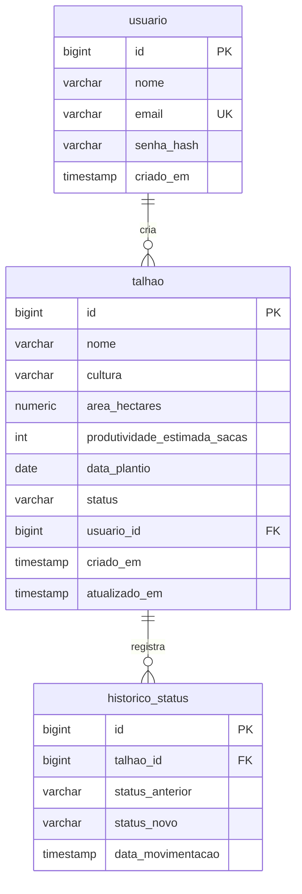

# AgroSafra v2 — Design / Spec

> **Data:** 2026-06-11 (data de entrega do trabalho)
> **Disciplina:** Desenvolvimento de Software WEB — Prof. Alexandre Cláudio de Almeida (PUC Goiás / ADS)
> **Objetivo:** evoluir o front-end existente (React) e construir o back-end em Java/Spring com banco de dados integrado, segurança e comunicação front ↔ back, atendendo todos os critérios de avaliação.

---

## 1. Contexto e requisitos do professor

O front-end (N1) já existe: React 18 + Vite + TypeScript, lista talhões agrícolas mockados e avança o ciclo de safra (Plantio → Crescimento → Colheita → Comercializado). Para a entrega final é exigido:

- Back-end em **Java + Spring**, incluindo a **segurança apresentada na aula de 11/05** (Spring Security + JWT).
- **Banco de dados** integrado, com **diagrama ER**.
- **Comunicação clara** entre front e back.
- Código **documentado e comentado**; repositório **GitHub** com front e back.
- Avaliação: layout/design, funcionalidades sem bugs, conteúdo de aula aplicado, banco + diagrama, legibilidade, documentação, apresentação.

## 2. Decisões tomadas

| Decisão | Escolha |
|---|---|
| Segurança | Spring Security **stateless com JWT** (HS256, BCrypt para senhas) |
| Banco | **PostgreSQL via Supabase** (perfil `prod`); **H2 em modo PostgreSQL** no perfil `dev` enquanto o Supabase não é configurado |
| Escopo funcional | **CRUD completo de talhões + login/registro** + avanço de ciclo persistido |
| Arquitetura back | Camadas clássicas: `controller → service → repository`, DTOs com Bean Validation, `@RestControllerAdvice` |
| Estrutura do repo | **Monorepo**: `frontend/` + `backend/` + `docs/` + README raiz |
| Complementos | **Histórico de movimentações de status** + **gráficos no dashboard** (Recharts) |
| Fora do escopo | Swagger, roles ADMIN/USER, deploy online, testes automatizados, exportação PDF/CSV, dark mode |

## 3. Estrutura do repositório

```
Projeto Alexandre/ (repo GitHub)
├── README.md            → visão geral, como rodar, diagrama ER, justificativas técnicas
├── docs/
│   └── diagrama-er.md   → diagrama ER (Mermaid) + script DDL
├── frontend/            → projeto React atual movido para cá
└── backend/             → Spring Boot 3 + Maven + Java 21
```

Comunicação: o front consome a API via `fetch` com header `Authorization: Bearer <token>`. Em dev, o Vite faz proxy de `/api` → `http://localhost:8080`. O back também configura CORS explicitamente (para a apresentação funcionar fora do proxy).

## 4. Modelo de dados (3 tabelas)



- `talhao.usuario_id` é "criado por" — **sem filtro por dono** (todos os usuários autenticados veem todos os talhões; simplifica a demo sem multiusuário).
- `status` e `cultura` são enums Java persistidos como `varchar` (`PLANTIO`, `CRESCIMENTO`, `COLHEITA`, `COMERCIALIZADO`; `SOJA`, `MILHO`, `CAFE`, `CANA_DE_ACUCAR`, `ALGODAO`).
- Cada avanço de ciclo grava uma linha em `historico_status` (na mesma transação do update).
- Schema gerado por JPA (`ddl-auto`) + seed via `data.sql` (mesmos 6 talhões do mock atual + 1 usuário demo). O DDL equivalente é documentado em `docs/diagrama-er.md`.

## 5. Back-end (Spring Boot 3, Maven, Java 21)

```
backend/src/main/java/br/pucgo/agrosafra/
├── AgroSafraApplication.java
├── config/        → SecurityConfig, CorsConfig
├── security/      → JwtService, JwtAuthFilter, UserDetailsServiceImpl
├── controller/    → AuthController, TalhaoController
├── service/       → AuthService, TalhaoService
├── repository/    → UsuarioRepository, TalhaoRepository, HistoricoStatusRepository
├── model/         → Usuario, Talhao, HistoricoStatus, StatusSafra (enum), TipoCultura (enum)
├── dto/           → RegistroRequest, LoginRequest, LoginResponse, TalhaoRequest, TalhaoResponse, HistoricoResponse
└── exception/     → GlobalExceptionHandler, RecursoNaoEncontradoException
```

### Endpoints

| Método | Rota | Auth | Descrição |
|---|---|---|---|
| POST | `/api/auth/registro` | pública | cria usuário (senha com BCrypt) |
| POST | `/api/auth/login` | pública | autentica e retorna JWT |
| GET | `/api/talhoes` | JWT | lista, filtros opcionais `?status=&cultura=&busca=` |
| GET | `/api/talhoes/{id}` | JWT | detalhe |
| GET | `/api/talhoes/{id}/historico` | JWT | linha do tempo de movimentações |
| POST | `/api/talhoes` | JWT | cria (Bean Validation no DTO) |
| PUT | `/api/talhoes/{id}` | JWT | edita |
| PATCH | `/api/talhoes/{id}/avancar-status` | JWT | avança o ciclo + grava histórico |
| DELETE | `/api/talhoes/{id}` | JWT | exclui |

### Segurança

- Spring Security stateless (`SessionCreationPolicy.STATELESS`).
- `JwtAuthFilter` registrado antes do `UsernamePasswordAuthenticationFilter`; valida o token e popula o `SecurityContext`.
- Token HS256, secret via variável de ambiente (`JWT_SECRET`), expiração 24h.
- Senhas com `BCryptPasswordEncoder`.
- Respostas 401/403 em JSON padronizado (mesmo formato do `GlobalExceptionHandler`).

### Regras de negócio (TalhaoService)

- Avanço de ciclo segue a ordem fixa PLANTIO → CRESCIMENTO → COLHEITA → COMERCIALIZADO → PLANTIO (lógica sai do front e vai para o service).
- Ao avançar, grava `historico_status` na mesma transação (`@Transactional`).
- Filtros de listagem resolvidos no repository (query derivada ou `@Query`).

### Configuração

- Perfis: `dev` (H2 modo PostgreSQL, console habilitado) e `prod` (Supabase via `SPRING_DATASOURCE_URL`/`USERNAME`/`PASSWORD`).
- `.env.example`/`application-prod.properties.example` documentando variáveis. **Nenhuma credencial commitada.**
- Javadoc em pt-BR nas classes públicas + comentários explicando decisões não óbvias.

## 6. Front-end (evolução do projeto atual)

- **Login/Registro** (`/login`): página estilizada com identidade agro, validação de formulário, feedback de erro; token salvo no `localStorage`; sem token válido → redireciona pro login.
- **Serviço de API** (`src/services/api.ts`): wrapper de `fetch` que injeta o token, trata 401 (desloga e redireciona) e centraliza a base URL.
- **CRUD**: modal de criar/editar talhão com validação (nome obrigatório, cultura, área > 0, data); excluir com confirmação; avanço de status chama o `PATCH` e atualiza a lista.
- **Histórico**: ação no card abre modal com a linha do tempo do talhão (`GET /historico`).
- **Filtros e busca**: barra acima da lista — busca por nome + filtros de status e cultura (client-side sobre os dados carregados).
- **Gráficos no dashboard** (Recharts): pizza "talhões por status" + barras "área por cultura", derivados dos mesmos dados da lista.
- **Polimento visual**: paleta agro refinada, hierarquia dos cards, badges com cor por etapa do ciclo, estados de loading/erro/vazio, microinterações. Mantém Bootstrap 5 + `global.css`.
- Estado: `useState` em `App.tsx` passa a ser populado pela API (mock atual vira `data.sql` do back). Sem biblioteca de estado nova.

## 7. Documentação e entrega

- **README raiz**: visão geral, stack, instruções de execução (front e back, perfis dev/prod), diagrama ER (Mermaid renderiza no GitHub), justificativa das escolhas técnicas — serve de roteiro para a apresentação.
- **docs/diagrama-er.md**: diagrama + DDL comentado.
- Commits incrementais com mensagens descritivas.

## 8. Ordem de execução e riscos

Entrega é **hoje (11/06)** — ordem pensada para cortar o menos importante se o tempo apertar:

1. Reestruturar repo (mover front para `frontend/`).
2. Back-end completo (auth + CRUD + histórico) validado manualmente.
3. Integração do front (login, API service, CRUD, histórico).
4. Gráficos no dashboard.
5. Polimento visual.
6. README + diagrama.

**Riscos e mitigação:**
- *Supabase não configurado ainda* → perfil `dev` com H2 permite desenvolver e até apresentar; trocar para Supabase é só configuração de ambiente.
- *Tempo* → se apertar, corta-se na ordem inversa: polimento → gráficos. CRUD, segurança, banco e documentação são requisitos e não se cortam.

## 9. Critérios de aceite

- [ ] Login e registro funcionando com JWT; rotas de talhões retornam 401 sem token.
- [ ] CRUD completo de talhões persistido no banco, sem erros no console.
- [ ] Avanço de ciclo grava histórico e o modal de linha do tempo exibe as movimentações.
- [ ] Dashboard com contadores + 2 gráficos atualizando conforme os dados.
- [ ] Filtros e busca funcionando na listagem.
- [ ] Diagrama ER no repo, condizente com o schema real.
- [ ] README com instruções que permitem rodar o projeto do zero.
- [ ] Nenhuma credencial commitada.
